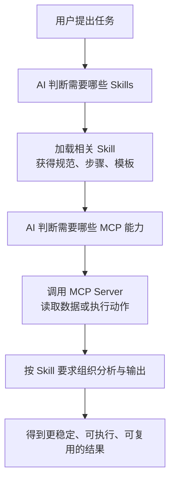

很多人在接触 Claude Code、Codex CLI、Gemini CLI、Cursor 以及各类 Agent 平台之后，都会被几个词绕晕：`MCP`、`Skills`、`Tool`、`Prompt`、`Agent` 到底是什么关系？本文专门把这个问题讲透，并补上命令行工具里的实际接法。

<!--more-->

## 一句话先说结论

- `MCP` 解决的是 **连接和能力暴露** 的问题，让 AI 能接触外部系统、数据和操作能力。
- `Skills` 解决的是 **方法和流程复用** 的问题，让 AI 知道某类任务应该如何稳定地完成。
- 最佳实践通常不是二选一，而是 **MCP 负责“能做”，Skills 负责“会做”**。

如果你只记一句话，可以记成：

```text
MCP = 给 AI 接上外部世界
Skills = 给 AI 装上某类任务的说明书和工作流
```

---

## 一、MCP 到底是什么

`MCP` 全称是 `Model Context Protocol`。它本质上是一个开放标准，用来让 AI 应用以统一方式连接外部系统。

官方文档常用一个很好理解的类比：`MCP` 像 AI 世界里的 `USB-C` 接口。不同的数据源、工具和服务，只要按同一个协议暴露出来，支持 MCP 的 AI 客户端就能接上去用。

### 1.1 MCP 不是单个工具，而是一套协议

很多文章把 MCP 直接说成“工具调用协议”，这不算错，但不够完整。更准确地说，MCP 是一套 **客户端-服务端协议**，其能力通常包括：

- `Tools`：让模型调用操作能力，比如搜索、执行查询、发请求、操作浏览器。
- `Resources`：向模型暴露可读取的上下文资源，比如文档、文件、数据库内容、知识条目。
- `Prompts`：向客户端提供可复用的提示模板或交互工作流。

也就是说，MCP 不只是“让 AI 调接口”，它还负责把 **外部上下文和操作能力** 用统一标准提供出来。

### 1.2 MCP 的典型架构

```text
用户
  ↓
AI 应用 / Host（Claude Desktop、IDE、Agent 平台）
  ↓
MCP Client
  ↓
MCP Server
  ↓
数据库 / 本地文件 / GitHub / 浏览器 / 内部系统 / 第三方 API
```

从架构上看：

- `Host` 是 Claude Desktop、IDE、聊天应用这类承载 AI 的程序。
- `Client` 是 Host 内部的 MCP 客户端实现。
- `Server` 是真正暴露能力的一侧，可以是本地服务，也可以是远程服务。

### 1.3 MCP 最适合解决什么问题

当你遇到下面这些需求时，优先考虑 MCP：

- 让 AI 读取数据库表结构或执行查询
- 让 AI 访问 GitHub、Notion、Jira、Slack 等外部系统
- 让 AI 操作浏览器、终端或文件系统
- 让 AI 使用组织内部 API 或私有知识服务
- 让多个 AI 客户端共享同一套接入标准

### 1.4 为什么 MCP 很重要

如果没有 MCP，AI 工具接入每个外部系统都要各写一套私有适配层。这样会导致：

- 接入成本高
- 不同平台之间不兼容
- 工具迁移困难
- 权限和安全模型难统一

MCP 的价值就是把这件事标准化。

---

## 二、Skills 到底是什么

`Skills` 可以理解成 AI 的“专项任务包”。

它不是一个外部连接协议，也不是后台常驻服务，而是一组可以动态装载的内容，通常包含：

- 任务说明
- 执行步骤
- 约束规则
- 模板
- 示例
- 辅助脚本
- 参考资料

Skills 的核心目标不是“连接世界”，而是 **让模型在某类任务上做得更稳、更一致、更符合你的规范**。

### 2.1 Skills 的关键特征

Skills 一般有几个非常鲜明的特点：

- 面向特定任务，而不是面向所有问题
- 强调可复用流程，而不是一次性提示词
- 按需加载，而不是始终把全部内容塞进上下文
- 可以被团队共享，沉淀成组织经验

### 2.2 Skills 不是普通 Prompt 的简单别名

把 Skills 理解成“高级 Prompt”有一点点接近，但还是偏窄。

更准确地说：

- `Prompt` 往往是一段单次对话提示
- `Skills` 往往是一个可持续复用的任务包

一个 Skill 内部可能包含提示词，但它通常还会附带：

- 任务触发描述
- 详细操作规范
- 输出格式要求
- 示例输入输出
- 参考文件
- 脚本和模板

所以 Skill 更像：

```text
Prompt + 规范 + 模板 + 参考资料 + 可选脚本
```

### 2.3 Skills 最适合解决什么问题

当你遇到这些需求时，优先考虑 Skills：

- 统一代码审查流程
- 统一 API 设计规范
- 统一测试报告格式
- 统一品牌文案风格
- 统一需求分析、排障、复盘的步骤
- 让 AI 在某类任务上总按你的方法做

---

## 三、MCP 和 Skills 的核心区别

| 维度 | MCP | Skills |
|------|-----|-------|
| 核心目标 | 连接外部系统并暴露能力 | 复用任务方法与流程 |
| 本质 | 协议 / 集成层 | 指令包 / 工作流包 |
| 解决的问题 | AI 能不能获取信息、调用能力 | AI 应该怎样更好地完成任务 |
| 典型形态 | MCP Server + Client 协议通信 | `Skill.md` + 参考文件 + 脚本等 |
| 是否需要常驻进程 | 通常需要服务端进程 | 通常不需要 |
| 是否依赖外部系统 | 经常依赖 | 不一定依赖 |
| 对上下文的影响 | 工具能力在客户端可见 | 通常按需动态加载 |
| 更像什么 | 手、接口、插座 | 经验、规范、作战手册 |

最实用的比喻是：

- `MCP` 像给 AI 装上手和外设接口
- `Skills` 像给 AI 发一本该任务的标准作业指导书

---

## 四、为什么很多人会把它们混淆

因为它们都在“增强 AI 能力”，但增强的方向完全不同。

### 4.1 看起来都能让 AI 变强

从用户视角看，不管你加的是 MCP 还是 Skills，最后体感都是：

- AI 变得更懂业务了
- AI 能做更多事了
- AI 回答更像团队里的人了

但底层原因不同：

- MCP 让它 **拿到更多上下文、执行更多动作**
- Skills 让它 **用更合适的方法去思考和输出**

### 4.2 一些场景确实会重叠

例如“代码审查”这个任务：

- 你需要 GitHub MCP 才能读取 PR 和提交记录
- 你需要 code-review Skill 才能让 AI 按团队标准审查

这会让人误以为二者在替代彼此。实际上，它们是在不同层面协同。

---

## 五、MCP 和 Skills 应该怎样配合

这是最关键的一节。

### 5.1 只用 MCP 会怎样

只用 MCP，AI 有能力访问外部系统，但不一定知道你希望它如何完成任务。

例如：

- 能查数据库，但不知道你们怎么分析异常订单
- 能读仓库，但不知道你们代码审查的重点
- 能调用接口，但不知道文档该按什么格式输出

结果通常是：**能做，但不稳定**。

### 5.2 只用 Skill 会怎样

只用 Skills，AI 知道流程和规范，但可能拿不到真实数据，也无法执行操作。

例如：

- 知道怎么写审查意见，但读不到实际 PR
- 知道怎么排查日志，但连不上日志系统
- 知道怎么做竞品分析，但无法访问网页和数据库

结果通常是：**会做，但缺手缺脚**。

### 5.3 两者结合的理想状态



这才是工程上最靠谱的形态：

- `Skills` 负责思路、标准和工作流
- `MCP` 负责数据、工具和执行能力

---

## 六、一个最容易懂的实战例子

假设你要做一个“生产问题排查助手”。

### 6.1 仅有 Skill

你给 AI 配了一个故障排查 Skill，里面写了：

- 先确认故障范围
- 再看错误日志
- 再查最近发布记录
- 再比对数据库异常数据
- 最后给出根因和修复建议

这很好，但如果它：

- 读不到日志平台
- 查不到发布系统
- 查不到数据库

那它依然只能纸上谈兵。

### 6.2 仅有 MCP

你给 AI 接上了：

- 日志平台 MCP
- 数据库 MCP
- GitHub MCP
- 发布系统 MCP

这时 AI 确实“摸得到”所有系统了。但如果没有统一排障方法，它很容易：

- 东查一点、西查一点
- 结论不稳定
- 输出风格混乱
- 忽略团队经验

### 6.3 MCP + Skill

最佳状态是：

- 用 Skills 规定排障顺序、证据模板、结论格式
- 用 MCP 获取日志、数据库、发布记录和代码变更

这样 AI 才会从“能访问系统”升级到“像一位熟悉你们团队的方法论的工程师”。

---

## 七、如何判断一个需求该用 MCP、Skills，还是两者都用

你可以用一个非常实用的判断法：

### 7.1 先问自己两个问题

问题 1：这个需求是否需要 AI 连接外部系统、读取实时数据、执行操作？

- 如果答案是“需要”，偏向 `MCP`

问题 2：这个需求是否需要 AI 严格遵循某套方法、规范、流程或输出格式？

- 如果答案是“需要”，偏向 `Skills`

### 7.2 快速选择表

| 场景 | 更适合 |
|------|--------|
| 查询数据库、读文件、调 API | MCP |
| 团队代码规范、文档规范、排障流程 | Skills |
| 既要查系统又要按规范分析 | MCP + Skills |
| 单次聊天里的简单写作要求 | Prompt 即可 |
| 长期复用的结构化任务流程 | Skills |

---

## 八、MCP、Skills、Tool、Prompt、Agent 之间的关系

这几个概念最好一起看，不然容易再次混淆。

### 8.1 Prompt

最基础的一层，是你给模型的一次性指令。

### 8.2 Tool

是模型可调用的具体能力，比如搜索、计算、发请求、执行脚本。

在很多系统里，MCP Server 会把某些能力暴露成 `Tool`。

### 8.3 MCP

是让这些外部能力和上下文以统一标准接入 AI 的协议层。

### 8.4 Skills

是对一类任务的方法论封装，让 AI 在执行任务时更稳定地使用知识、流程和模板。

### 8.5 Agent

Agent 是更高一层的运行形态。它通常会组合：

- 模型能力
- Prompt
- Tool
- MCP 接入
- Skills 方法论
- 记忆
- 规划与执行

可以把关系理解成：

```text
Prompt：告诉模型这次要做什么
Tool：让模型有具体能力可调用
MCP：把外部能力和上下文标准化接进来
Skills：教模型按什么方法把事做对
Agent：把这些能力组织起来持续执行任务
```

---

## 九、CLI 里如何理解和使用 MCP、Skills

很多人看到官方文档之后，会误以为所有 CLI 都把 `MCP` 和 `Skills` 做成了同一种形态。其实不是。

截至 `2026-04-24`，更准确的理解应该是：

- `Claude Code`：`MCP` 和 `Skills` 都很完整，而且文档最清楚
- `Codex CLI`：`MCP` 官方支持很明确，`Skills` 也已经进入官方文档体系，但日常使用里常常和 `AGENTS.md`、插件一起配合
- `Gemini CLI`：`MCP` 有官方支持，`Skills` 也有官方文档；但它还有一个很容易混淆的概念叫 `GEMINI.md`

这里最重要的纠正是：

- `GEMINI.md` 不是 `Skills`
- `AGENTS.md` 也不等于 `MCP`
- `MCP` 解决连接问题
- `Skills` 解决方法复用问题

---

## 十、Claude Code 中怎么接入和使用 MCP、Skills

### 10.1 Claude Code 的 MCP 接入

Claude Code 当前官方文档和本机命令都明确支持 `mcp` 子命令。

我在这台机器上本机确认到：

```bash
claude mcp --help
```

能看到下面这些核心命令：

- `claude mcp add`
- `claude mcp list`
- `claude mcp get`
- `claude mcp remove`
- `claude mcp serve`

其中最常用的是 `add`。

本机帮助里直接给了两类典型接法：

```bash
# HTTP MCP
claude mcp add --transport http sentry https://mcp.sentry.dev/mcp

# stdio MCP
claude mcp add -e API_KEY=xxx my-server -- npx my-mcp-server
```

这说明 Claude Code 的 MCP 接入至少覆盖了：

- `HTTP` 远程 MCP
- `stdio` 本地 MCP
- 环境变量注入

如果你只想理解工作流，可以记成：

```text
1. 用 claude mcp add 把服务器注册进去
2. 让 Claude Code 在会话里感知这些工具/资源
3. 在任务需要时调用对应 MCP 能力
```

### 10.2 Claude Code 的 Skills

Claude Code 官方文档里已经把以前的 `custom commands` 合并进 `Skills` 体系，这一点很重要。

也就是说，Claude Code 里的 Skills 不是“附属小功能”，而是正式的可复用任务模块。

它的常见目录通常是：

```text
~/.claude/skills/
.claude/skills/
```

其中一个 Skill 通常至少有：

```text
my-skill/
└── SKILL.md
```

然后再按需要加：

- `scripts/`
- `templates/`
- `reference/`

Claude Code 会在相关任务出现时自动加载对应 Skill，也支持在对话里显式调用。

### 10.3 Claude Code 里最实用的组合方式

如果你在 Claude Code 里做工程任务，最稳的方式通常是：

- 用 `Skills` 固化团队规范
- 用 `MCP` 读取外部系统

例如：

- `code-review` Skill 规定审查步骤
- `github` MCP 负责读取 PR
- `sentry` MCP 负责读取错误

这样 Claude Code 才不是“会调工具但不会分析”，也不是“会分析但拿不到真实数据”。

---

## 十一、Codex CLI 中怎么接入和使用 MCP、Skills

### 11.1 Codex CLI 的 MCP 接入

`Codex CLI` 当前官方文档和本机命令都明确支持 `mcp` 子命令。

我在这台机器上本机确认到：

```bash
codex mcp --help
codex mcp add --help
```

能看到这些关键信息：

- 支持 `codex mcp add`
- 支持 `codex mcp list`
- 支持 `codex mcp get`
- 支持 `codex mcp remove`
- `add` 同时支持 `--url` 和 `-- <COMMAND>...`

这意味着 Codex CLI 同时支持两种常见接法：

```bash
# 远程 HTTP MCP
codex mcp add my-http-server --url https://example.com/mcp

# 本地 stdio MCP
codex mcp add my-stdio-server -- npx my-mcp-server
```

如果远程服务器需要 Bearer Token，本机帮助里还明确有：

```bash
--bearer-token-env-var <ENV_VAR>
```

所以它的工作流也很清楚：

```text
1. 用 codex mcp add 注册 MCP
2. 用 codex mcp list / get 检查配置
3. 在交互会话或 exec 中让 Codex 使用它
```

### 11.2 Codex CLI 的 Skills

这里要比 Claude Code 写得更谨慎一点。

截至 `2026-04-24`，OpenAI 官方 Codex 文档站点里已经有独立的 `Skills` 页面，也能确认到 `SKILL.md` 这种结构；但从 CLI 命令面看，Codex 当前并没有像 `mcp` 那样暴露一个独立的 `skills` 子命令。

这意味着在实际使用时，你更应该把 Codex 的 Skills 理解为：

- 一种文档化、目录化的可复用任务能力
- 会和 `AGENTS.md`、插件、项目配置一起配合
- 不是一个和 `mcp` 完全对称的命令入口

换句话说：

- `Codex MCP` 更像“显式注册外部能力”
- `Codex Skills` 更像“组织和复用任务方法”

### 11.3 在 Codex CLI 里怎么用更稳

如果你现在就要落地，建议优先按这个顺序：

1. 先把 `MCP` 接通，因为这部分最明确、最可验证
2. 再把项目级约束先沉淀进 `AGENTS.md` 或官方 Skills 目录
3. 最后视版本能力决定是否把部分流程迁移到 Skills

这么做的原因很简单：

- `MCP` 的连接是否成功，很容易验证
- `Skills` 的触发和组织方式，会比 MCP 更依赖具体版本和文档演进

所以如果你在做 `Codex CLI + MCP + 项目规范`，最务实的方案不是等所有抽象都完全统一，而是先把“连接层”和“方法层”分别做好。

---

## 十二、Gemini CLI 中怎么接入和使用 MCP、Skills

### 12.1 Gemini CLI 的 MCP 接入

Gemini CLI 官方 GitHub 文档里有独立的 `MCP Servers` 文档，而且命令参考里已经明确列出了 `gemini mcp` 的常见用法，说明它已经把 MCP 作为正式能力来支持。

按照官方文档，Gemini CLI 的 MCP 配置通常放在用户级或项目级 `settings.json` 中，常见位置可以记成：

```text
~/.gemini/settings.json
```

文档里给出的典型命令包括：

```bash
# 添加本地 stdio MCP
gemini mcp add github npx -y @modelcontextprotocol/server-github

# 添加 HTTP MCP
gemini mcp add api-server http://localhost:3000 --transport http

# 带环境变量
gemini mcp add slack node server.js --env SLACK_TOKEN=xoxb-xxx

# 指定 scope
gemini mcp add db node db-server.js --scope user
```

这说明 Gemini CLI 的 MCP 至少覆盖了：

- 本地 `stdio` 服务器
- 远程 `HTTP` 服务器
- 环境变量
- 作用域
- 配置文件持久化

所以它和 Claude Code、Codex CLI 一样，本质上也是：

- 先注册 MCP
- 再在会话中调用 MCP 暴露出来的能力

### 12.2 Gemini CLI 的 Skills 和 GEMINI.md 不是一回事

这是 Gemini 体系里最容易写错的一点。

Gemini CLI 官方文档里既有 `skills` 管理命令，也有 `GEMINI.md` 的层级内存机制。

命令参考页已经列出：

```bash
gemini skills list
gemini skills install <source>
gemini skills link <path>
gemini skills uninstall <name>
gemini skills enable <name>
gemini skills disable <name>
```

同时，配置参考页里还有：

- `skills.enabled`
- `skills.disabled`

而 `GEMINI.md` 相关文档写的是 `/memory reload`、`/memory show` 这套上下文管理机制。

所以 Gemini CLI 官方文档里实际并存的是三套东西：

- `GEMINI.md` 层级记忆
- `Agent Skills`
- `MCP Servers`

你可以这样理解：

- `GEMINI.md`：项目或目录级的持续指令文件，类似“长期上下文”
- `Agent Skills`：可安装、可复用、可组合的专项能力包

所以不要把 `GEMINI.md` 误写成“Gemini 的 Skills”。

更准确的关系是：

```text
GEMINI.md = 常驻项目说明
Agent Skills = 专项任务能力包
MCP = 外部能力接入
```

### 12.3 Gemini CLI 最适合的组合方式

在 Gemini CLI 里，比较清楚的组织方式通常是：

- 用 `GEMINI.md` 放长期约束
- 用 `Agent Skills` 放专项流程
- 用 `MCP` 接浏览器、数据库、GitHub、内部服务

这三者并不冲突，反而层次很清楚。

---

## 十三、三种 CLI 放在一起怎么理解

如果把 `Claude Code`、`Codex CLI`、`Gemini CLI` 放在一起看，可以得到一个比较清晰的对比：

| 工具 | MCP | Skills | 需要特别注意的点 |
|------|-----|--------|------------------|
| `Claude Code` | 官方支持完整，命令清晰 | 官方支持完整，目录化明显 | 以前的 custom commands 已并入 Skills |
| `Codex CLI` | 官方支持完整，本机命令可验证 | 官方文档已有 Skills 页面，但命令入口不如 MCP 显式 | 实战里常和 `AGENTS.md`、插件一起配合 |
| `Gemini CLI` | 官方支持完整 | 官方支持 Agent Skills | `GEMINI.md` 不是 Skills |

如果再压缩成一句话：

```text
Claude Code：MCP 和 Skills 都成熟
Codex CLI：MCP 最明确，Skills 正在进入更完整的官方体系
Gemini CLI：MCP + Agent Skills + GEMINI.md 三层并存
```

---

## 十四、常见误区

### 14.1 误区一：MCP 就是 Tools

不完全对。

`Tools` 只是 MCP 常见能力之一。MCP 还可以暴露 `resources` 和 `prompts` 等内容。

### 14.2 误区二：Skills 就是一段 Prompt

不完全对。

Skills 可以包含 Prompt，但它更像一个围绕特定任务组织起来的完整包。

### 14.3 误区三：有了 MCP 就不需要 Skills

不对。

MCP 解决的是“接得上”，Skills 解决的是“做得好”。

### 14.4 误区四：有了 Skills 就不需要 MCP

也不对。

Skills 无法代替真实的数据访问、系统连接和操作能力。

### 14.5 误区五：GEMINI.md、AGENTS.md、Skills 是一回事

不对。

它们都可能承载“方法论”或“上下文”，但层次不同：

- `GEMINI.md` 更像 Gemini 的长期项目说明
- `AGENTS.md` 更像 Codex 的项目约束和协作说明
- `Skills` 更像可复用的专项任务包

---

## 十五、一个适合团队落地的实践方案

如果你正在公司里推进 AI 工程化，可以按下面这条路线走。

### 15.1 第一步：先梳理高频任务

例如：

- 代码审查
- API 设计
- 线上故障排查
- 周报生成
- 数据分析报告

### 15.2 第二步：把“方法论”沉淀成 Skills

每个高频任务整理出：

- 什么时候触发
- 输入需要什么
- 按什么步骤做
- 输出格式是什么
- 常见错误有哪些

### 15.3 第三步：把“数据和动作能力”接成 MCP

例如：

- GitHub
- Jira
- 日志平台
- 数据库
- 文档系统
- 浏览器自动化

### 15.4 第四步：在不同 CLI 里映射到合适载体

例如：

- `Claude Code`：优先用 `Skills + MCP`
- `Codex CLI`：优先用 `MCP + AGENTS.md / Skills`
- `Gemini CLI`：优先用 `MCP + Agent Skills + GEMINI.md`

这一步很重要，因为不同 CLI 的“方法层载体”并不完全一样。

---

## 十六、最终总结

把今天这篇文章压缩成最重要的五句话：

1. `MCP` 是连接标准，负责让 AI 接入外部数据、工具和工作流。
2. `Skills` 是任务方法包，负责让 AI 按特定规范稳定完成任务。
3. `Claude Code`、`Codex CLI`、`Gemini CLI` 都在支持 MCP，但 Skills 的落地方式不完全相同。
4. `Codex CLI` 里 `AGENTS.md` 不能等同于 Skills，`Gemini CLI` 里 `GEMINI.md` 也不能等同于 Skills。
5. 真正成熟的 Agent 工作流通常不是 `MCP` 或 `Skills` 二选一，而是两者配合。

如果你正在做 AI 编程助手、企业知识助手、运维排障助手或者任何 Agent 系统，最值得建立的心智模型是：

```text
MCP 决定 AI 能接触什么
Skills 决定 AI 应该怎么做
Agent 决定 AI 如何把这些能力组织起来完成任务
```

---

## 参考资料

以下资料均为我整理本文时参考的官方资料，适合继续深挖：

- Model Context Protocol Official Docs
  https://modelcontextprotocol.io/
- MCP Specification Overview
  https://modelcontextprotocol.io/specification/2025-06-18/basic
- Claude Code: MCP
  https://code.claude.com/docs/en/mcp
- Claude Code: Skills
  https://code.claude.com/docs/en/skills
- Anthropic Help Center: What are Skills?
  https://support.claude.com/en/articles/12512176-what-are-skills
- OpenAI Codex: MCP
  https://developers.openai.com/codex/mcp
- OpenAI Codex: Skills
  https://developers.openai.com/codex/skills
- Google Gemini CLI: MCP Servers
  https://github.com/google-gemini/gemini-cli/blob/main/docs/tools/mcp-server.md
- Google Gemini CLI: CLI Commands Reference
  https://github.com/google-gemini/gemini-cli/blob/main/docs/reference/commands.md
- Google Gemini CLI: Configuration Reference
  https://github.com/google-gemini/gemini-cli/blob/main/docs/reference/configuration.md
- Google Gemini CLI: GEMINI.md / Memory
  https://github.com/google-gemini/gemini-cli/blob/main/docs/cli/gemini-md.md
