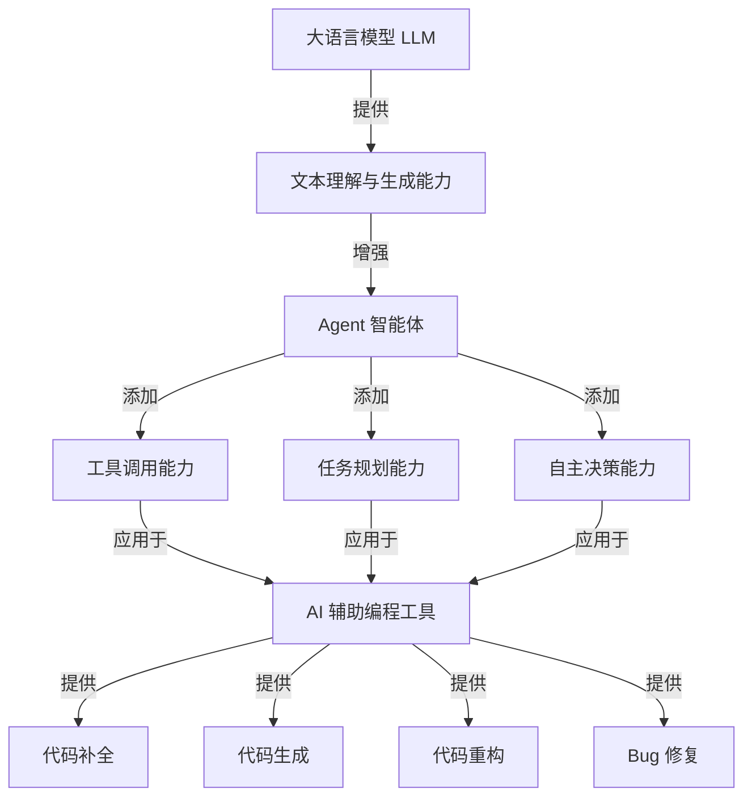
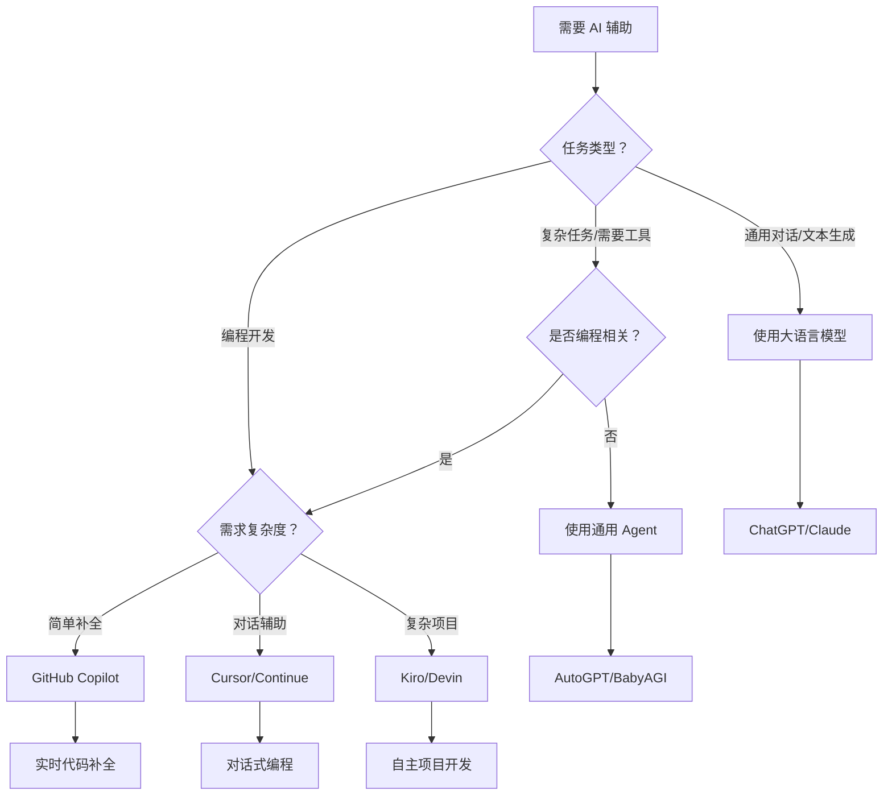

深入解析大语言模型（LLM）、Agent 智能体和 AI 辅助编程工具之间的层次关系、核心区别及实际应用场景。

<!--more-->

## 一、概念定义

### 1.1 大语言模型（LLM）

大语言模型（Large Language Model，简称 LLM）是人工智能的基础层，是一种基于深度学习的自然语言处理模型。

#### 核心特征

```
- 参数规模：通常包含数十亿到数千亿个参数
- 训练数据：在海量文本数据上进行预训练
- 能力范围：文本理解、生成、推理、翻译等
- 交互方式：主要通过文本输入输出（Prompt-Response）
```

#### 代表产品

- OpenAI GPT 系列（GPT-3.5、GPT-4、GPT-4o）
- Anthropic Claude 系列（Claude 3.5 Sonnet、Claude 3 Opus）
- Google Gemini 系列
- Meta Llama 系列
- 国内：文心一言、通义千问、智谱 GLM、Kimi、DeepSeek 等

#### 工作原理

```python
# 大模型的基本交互模式
user_input = "什么是人工智能？"
model_output = llm.generate(user_input)
print(model_output)
# 输出：人工智能（AI）是计算机科学的一个分支...
```

### 1.2 Agent 智能体

Agent 智能体是在大模型基础上构建的应用层，赋予模型"行动能力"和"自主决策能力"。

#### 核心特征

```
- 基础：以大模型作为"大脑"
- 能力：可以调用工具、执行任务、自主决策
- 记忆：具有短期和长期记忆能力
- 规划：能够分解复杂任务并制定执行计划
- 反馈：可以根据执行结果调整策略
```

#### Agent 架构

```
┌─────────────────────────────────────┐
│           Agent 智能体               │
├─────────────────────────────────────┤
│  ┌───────────┐    ┌──────────────┐ │
│  │  感知层   │───▶│   大模型核心  │ │
│  │ Perception│    │   (LLM Brain) │ │
│  └───────────┘    └──────────────┘ │
│         │                │          │
│         ▼                ▼          │
│  ┌───────────┐    ┌──────────────┐ │
│  │  记忆层   │    │   决策层      │ │
│  │  Memory   │    │   Planning    │ │
│  └───────────┘    └──────────────┘ │
│                          │          │
│                          ▼          │
│                   ┌──────────────┐ │
│                   │   工具调用    │ │
│                   │   Tool Use    │ │
│                   └──────────────┘ │
│                          │          │
│                          ▼          │
│                   ┌──────────────┐ │
│                   │   执行层      │ │
│                   │   Action      │ │
│                   └──────────────┘ │
└─────────────────────────────────────┘
```

#### 代表产品

- AutoGPT：自主任务执行
- BabyAGI：任务规划与执行
- LangChain Agent：工具链集成
- MetaGPT：多 Agent 协作
- ChatDev：软件开发 Agent
- Kiro（你正在使用的）：IDE 集成的编程 Agent


#### Agent 工作流程示例

```python
# Agent 的典型工作流程
class Agent:
    def __init__(self, llm, tools):
        self.llm = llm  # 大模型作为大脑
        self.tools = tools  # 可用工具集
        self.memory = []  # 记忆系统
    
    def run(self, task):
        # 1. 理解任务
        plan = self.llm.plan(task)
        
        # 2. 分解步骤
        steps = self.llm.decompose(plan)
        
        # 3. 执行步骤
        for step in steps:
            # 决策：选择合适的工具
            tool = self.select_tool(step)
            
            # 执行：调用工具
            result = tool.execute(step)
            
            # 记忆：保存结果
            self.memory.append(result)
            
            # 反思：评估是否需要调整
            if not self.is_success(result):
                self.adjust_plan(step)
        
        return self.summarize()
```

### 1.3 AI 辅助编程工具

AI 辅助编程工具是针对编程场景的专业化应用，可以基于大模型或 Agent 架构。

#### 核心特征

```
- 场景：专注于代码编写、调试、重构等编程任务
- 集成：深度集成到 IDE 或编辑器中
- 上下文：理解项目结构、代码库、依赖关系
- 实时性：提供实时代码补全和建议
```

#### 分类

**1. 代码补全型（基于大模型）**
- GitHub Copilot
- Tabnine
- Amazon CodeWhisperer
- Codeium

**2. 对话交互型（基于大模型 + 简单工具）**
- Cursor
- Continue
- Cody

**3. Agent 型（基于 Agent 架构）**
- Kiro（你正在使用的）
- Devin
- Codium AI
- Aider


---

## 二、层次关系

### 2.1 技术栈层次

```
┌─────────────────────────────────────────────┐
│        应用层：AI 辅助编程工具               │
│  ┌─────────────────────────────────────┐   │
│  │  GitHub Copilot, Cursor, Kiro...    │   │
│  └─────────────────────────────────────┘   │
└─────────────────────────────────────────────┘
                    ▲
                    │ 基于
                    │
┌─────────────────────────────────────────────┐
│        能力层：Agent 智能体                  │
│  ┌─────────────────────────────────────┐   │
│  │  工具调用 + 任务规划 + 自主决策      │   │
│  └─────────────────────────────────────┘   │
└─────────────────────────────────────────────┘
                    ▲
                    │ 基于
                    │
┌─────────────────────────────────────────────┐
│        基础层：大语言模型（LLM）             │
│  ┌─────────────────────────────────────┐   │
│  │  GPT-4, Claude, Gemini, Llama...    │   │
│  └─────────────────────────────────────┘   │
└─────────────────────────────────────────────┘
```

### 2.2 能力递进关系



### 2.3 依赖关系

```
大模型（必需）
    ↓
Agent（可选，增强能力）
    ↓
AI 辅助编程工具（应用场景）
```

- **大模型**是基础，没有大模型就没有后续一切
- **Agent** 是可选的增强层，让 AI 具备行动能力
- **AI 辅助编程工具**是具体应用，可以直接基于大模型，也可以基于 Agent


---

## 三、核心区别

### 3.1 功能对比

| 维度 | 大语言模型 | Agent 智能体 | AI 辅助编程工具 |
|------|-----------|-------------|----------------|
| **核心能力** | 文本理解与生成 | 任务规划与执行 | 代码编写辅助 |
| **交互方式** | 问答对话 | 自主决策 | IDE 集成 |
| **工具调用** | ❌ 不支持 | ✅ 支持 | ✅ 支持（部分） |
| **记忆能力** | 仅对话上下文 | 短期+长期记忆 | 项目上下文 |
| **自主性** | 被动响应 | 主动执行 | 半自主 |
| **应用场景** | 通用对话 | 复杂任务 | 编程开发 |
| **学习成本** | 低 | 中 | 低到中 |
| **可控性** | 高 | 中 | 高 |

### 3.2 使用场景对比

#### 大语言模型适用场景

```
✅ 文本生成：写文章、邮件、报告
✅ 信息查询：回答问题、解释概念
✅ 语言翻译：多语言互译
✅ 内容总结：提取关键信息
✅ 创意辅助：头脑风暴、方案建议

❌ 不适合：需要执行具体操作的任务
```

#### Agent 智能体适用场景

```
✅ 复杂任务：需要多步骤规划和执行
✅ 自动化流程：数据收集、分析、报告生成
✅ 研究助手：文献检索、信息整合
✅ 项目管理：任务分解、进度跟踪
✅ 多工具协作：需要调用多个 API 或工具

❌ 不适合：简单问答、实时性要求极高的场景
```

#### AI 辅助编程工具适用场景

```
✅ 代码补全：实时智能补全
✅ 代码生成：根据注释生成代码
✅ Bug 修复：识别并修复错误
✅ 代码重构：优化代码结构
✅ 测试生成：自动生成单元测试
✅ 文档生成：自动生成代码文档

❌ 不适合：非编程任务、需要深度业务理解的场景
```


### 3.3 技术实现对比

#### 大语言模型实现

```python
# 简单的大模型调用
import openai

response = openai.ChatCompletion.create(
    model="gpt-4",
    messages=[
        {"role": "user", "content": "解释什么是递归"}
    ]
)

print(response.choices[0].message.content)
```

#### Agent 智能体实现

```python
# Agent 实现示例（使用 LangChain）
from langchain.agents import initialize_agent, Tool
from langchain.llms import OpenAI
from langchain.memory import ConversationBufferMemory

# 定义工具
tools = [
    Tool(
        name="Calculator",
        func=lambda x: eval(x),
        description="用于数学计算"
    ),
    Tool(
        name="Search",
        func=search_web,
        description="用于网络搜索"
    ),
    Tool(
        name="FileReader",
        func=read_file,
        description="用于读取文件"
    )
]

# 初始化 Agent
llm = OpenAI(temperature=0)
memory = ConversationBufferMemory()
agent = initialize_agent(
    tools=tools,
    llm=llm,
    agent="zero-shot-react-description",
    memory=memory,
    verbose=True
)

# Agent 自主决策并执行
result = agent.run(
    "帮我计算项目预算，然后搜索相关供应商，最后生成报告"
)
```

#### AI 辅助编程工具实现

```python
# AI 编程工具的典型架构
class AICodeAssistant:
    def __init__(self, llm, code_context):
        self.llm = llm
        self.code_context = code_context  # 项目代码上下文
        self.file_tree = self.build_file_tree()
        self.dependencies = self.analyze_dependencies()
    
    def code_completion(self, cursor_position):
        """实时代码补全"""
        context = self.get_context(cursor_position)
        prompt = self.build_completion_prompt(context)
        return self.llm.complete(prompt)
    
    def generate_code(self, description):
        """根据描述生成代码"""
        context = self.get_project_context()
        prompt = f"""
        项目上下文：{context}
        需求描述：{description}
        请生成符合项目规范的代码
        """
        return self.llm.generate(prompt)
    
    def fix_bug(self, error_message):
        """修复 Bug"""
        related_code = self.find_related_code(error_message)
        prompt = f"""
        错误信息：{error_message}
        相关代码：{related_code}
        请分析问题并提供修复方案
        """
        return self.llm.analyze_and_fix(prompt)
```


---

## 四、实际应用案例

### 4.1 大语言模型应用案例

#### 案例 1：内容创作

```
用户：帮我写一篇关于云计算的技术博客

GPT-4：
# 云计算：改变世界的技术革命

云计算（Cloud Computing）是一种基于互联网的计算方式...
[生成完整文章]
```

**特点**：
- 单次交互完成
- 不需要调用外部工具
- 纯文本生成

#### 案例 2：代码解释

```
用户：解释这段代码的作用
def fibonacci(n):
    if n <= 1:
        return n
    return fibonacci(n-1) + fibonacci(n-2)

Claude：
这是一个递归实现的斐波那契数列函数...
[详细解释]
```

**特点**：
- 理解代码逻辑
- 提供清晰解释
- 不执行代码

### 4.2 Agent 智能体应用案例

#### 案例 1：自动化研究助手

```
用户：帮我研究"量子计算在密码学中的应用"并生成报告

Agent 执行流程：
1. [搜索工具] 搜索相关学术论文
2. [文件读取] 下载并阅读 Top 10 论文
3. [分析工具] 提取关键信息和观点
4. [总结工具] 生成结构化报告
5. [文件写入] 保存为 Markdown 文档

输出：已生成报告 quantum_crypto_research.md
```

**特点**：
- 多步骤自主执行
- 调用多个工具
- 有明确的执行计划

#### 案例 2：项目管理 Agent

```
用户：帮我管理这个软件项目

Agent 执行流程：
1. [代码分析] 分析项目结构和依赖
2. [任务分解] 将需求分解为具体任务
3. [优先级排序] 根据依赖关系排序
4. [进度跟踪] 监控各任务完成情况
5. [报告生成] 每日生成进度报告

持续运行，自主决策
```

**特点**：
- 长期运行
- 持续监控和决策
- 具有记忆和学习能力


### 4.3 AI 辅助编程工具应用案例

#### 案例 1：GitHub Copilot（代码补全型）

```python
# 用户输入注释
# 实现一个二分查找函数

# Copilot 自动补全
def binary_search(arr, target):
    left, right = 0, len(arr) - 1
    
    while left <= right:
        mid = (left + right) // 2
        if arr[mid] == target:
            return mid
        elif arr[mid] < target:
            left = mid + 1
        else:
            right = mid - 1
    
    return -1
```

**特点**：
- 实时补全
- 基于上下文
- 无需明确指令

#### 案例 2：Cursor（对话交互型）

```
用户：帮我重构这个函数，使用更 Pythonic 的写法

Cursor 分析代码并建议：
1. 使用列表推导式替代循环
2. 使用 enumerate 替代 range(len())
3. 添加类型注解

[应用修改]
```

**特点**：
- 对话式交互
- 理解项目上下文
- 可以批量修改

#### 案例 3：Kiro（Agent 型）

```
用户：帮我实现一个用户认证系统

Kiro 执行流程：
1. [分析需求] 理解认证系统的需求
2. [设计架构] 规划文件结构和模块
3. [创建文件] 创建必要的文件
   - models/user.py
   - auth/jwt_handler.py
   - routes/auth.py
   - tests/test_auth.py
4. [编写代码] 逐个实现各模块
5. [运行测试] 执行测试确保功能正常
6. [生成文档] 创建 API 文档

完成：用户认证系统已实现并测试通过
```

**特点**：
- 端到端自动化
- 多文件协同
- 自主测试和验证
- 具有项目级理解能力


---

## 五、如何选择

### 5.1 选择决策树



### 5.2 选择建议

#### 选择大语言模型，如果你需要：

```
✅ 快速获取信息和答案
✅ 文本创作和编辑
✅ 学习和理解概念
✅ 翻译和总结
✅ 简单的代码解释

推荐：ChatGPT、Claude、Gemini
```

#### 选择 Agent 智能体，如果你需要：

```
✅ 自动化复杂工作流程
✅ 多步骤任务规划和执行
✅ 需要调用多个工具和 API
✅ 长期运行的任务
✅ 自主决策和问题解决

推荐：LangChain + 自定义 Agent、AutoGPT
```

#### 选择 AI 辅助编程工具，如果你需要：

```
✅ 提高编码效率
✅ 实时代码补全
✅ 代码重构和优化
✅ Bug 修复建议
✅ 测试和文档生成
✅ 项目级代码理解

推荐：
- 新手/简单项目：GitHub Copilot
- 中级/对话需求：Cursor
- 高级/复杂项目：Kiro、Devin
```

### 5.3 组合使用策略

实际工作中，往往需要组合使用：

```
场景 1：学习新技术
1. 使用 ChatGPT 了解基本概念
2. 使用 Cursor 编写示例代码
3. 使用 Agent 自动化测试和部署

场景 2：开发新功能
1. 使用 Claude 进行需求分析和设计
2. 使用 Kiro 实现核心功能
3. 使用 Copilot 补全辅助代码

场景 3：问题排查
1. 使用 GPT-4 分析错误日志
2. 使用 Cursor 定位问题代码
3. 使用 Agent 自动化修复和测试
```


---

## 六、发展趋势

### 6.1 技术演进方向

```
2023 年：大模型爆发
├─ GPT-4、Claude 3 等强大模型发布
├─ 代码补全工具普及（Copilot）
└─ Agent 概念兴起

2024 年：Agent 元年
├─ 多模态 Agent 出现
├─ 工具调用能力标准化
├─ 长上下文窗口（100K+ tokens）
└─ AI 编程工具向 Agent 化发展

2025-2026 年：深度集成
├─ Agent 成为标配
├─ 多 Agent 协作成熟
├─ AI 原生开发流程
└─ 自主软件工程师（Devin、Kiro）

未来趋势：
├─ 更强的推理能力
├─ 更好的代码理解
├─ 更自主的决策
└─ 人机协作新模式
```

### 6.2 能力融合趋势

```
┌─────────────────────────────────────┐
│         未来的 AI 编程助手           │
├─────────────────────────────────────┤
│                                     │
│  ┌─────────────────────────────┐   │
│  │   大模型核心                 │   │
│  │   - 更强的推理能力           │   │
│  │   - 更长的上下文             │   │
│  │   - 多模态理解               │   │
│  └─────────────────────────────┘   │
│              ▲                      │
│              │                      │
│  ┌─────────────────────────────┐   │
│  │   Agent 能力                 │   │
│  │   - 自主任务规划             │   │
│  │   - 工具调用                 │   │
│  │   - 持续学习                 │   │
│  └─────────────────────────────┘   │
│              ▲                      │
│              │                      │
│  ┌─────────────────────────────┐   │
│  │   专业化能力                 │   │
│  │   - 深度代码理解             │   │
│  │   - 项目级重构               │   │
│  │   - 自动化测试               │   │
│  │   - 性能优化                 │   │
│  └─────────────────────────────┘   │
│                                     │
└─────────────────────────────────────┘
```

### 6.3 对开发者的影响

#### 短期影响（1-2 年）

```
✅ 编码效率提升 30-50%
✅ 减少重复性工作
✅ 更快的原型开发
✅ 降低学习新技术的门槛

⚠️ 需要学习如何与 AI 协作
⚠️ 需要提升代码审查能力
```

#### 中期影响（3-5 年）

```
✅ 开发流程重构
✅ 从"写代码"到"管理 AI"
✅ 更关注架构和业务逻辑
✅ 小团队完成大项目

⚠️ 初级开发岗位减少
⚠️ 对高级能力要求提高
```

#### 长期影响（5+ 年）

```
✅ AI 成为开发团队标配
✅ 人机协作新模式
✅ 软件开发民主化
✅ 创新速度大幅提升

⚠️ 职业技能要求转变
⚠️ 需要持续学习和适应
```


---

## 七、常见误区

### 7.1 误区一：Agent 就是大模型

❌ **错误认知**：Agent 和大模型是一回事

✅ **正确理解**：
- 大模型是"大脑"，负责理解和生成
- Agent 是"身体"，负责行动和执行
- Agent 基于大模型，但增加了工具调用、任务规划等能力

### 7.2 误区二：AI 编程工具会取代程序员

❌ **错误认知**：有了 AI 工具，不需要程序员了

✅ **正确理解**：
- AI 工具是辅助，不是替代
- 程序员的价值在于：
  - 理解业务需求
  - 架构设计
  - 代码审查
  - 问题解决
  - 创新思维
- AI 提升效率，让程序员专注于更高价值的工作

### 7.3 误区三：所有 AI 编程工具都一样

❌ **错误认知**：Copilot、Cursor、Kiro 功能相同

✅ **正确理解**：
```
GitHub Copilot：
- 专注实时补全
- 轻量级
- 适合日常编码

Cursor：
- 对话式交互
- 项目级理解
- 适合中等复杂度项目

Kiro：
- Agent 架构
- 自主任务执行
- 适合复杂项目和自动化
```

### 7.4 误区四：大模型越大越好

❌ **错误认知**：参数越多，效果越好

✅ **正确理解**：
- 不同任务需要不同模型
- 小模型在特定任务上可能更好
- 需要考虑：
  - 成本
  - 速度
  - 隐私
  - 部署难度

```
选择建议：
- 简单任务：GPT-3.5、Claude Haiku
- 复杂推理：GPT-4、Claude Opus
- 代码生成：专门的代码模型
- 本地部署：Llama、Mistral
```

### 7.5 误区五：Agent 可以完全自主

❌ **错误认知**：Agent 可以独立完成所有工作

✅ **正确理解**：
- Agent 需要明确的目标和约束
- 复杂任务仍需人工监督
- 可能出现错误，需要人工干预
- 最佳模式是人机协作


---

## 八、实践建议

### 8.1 入门路径

#### 第一阶段：熟悉大模型（1-2 周）

```
1. 注册并使用主流大模型
   - ChatGPT (OpenAI)
   - Claude (Anthropic)
   - Gemini (Google)

2. 学习 Prompt 工程
   - 清晰的指令
   - 提供上下文
   - 分步骤引导
   - 角色扮演

3. 实践场景
   - 代码解释
   - 文档生成
   - 问题解答
   - 方案设计
```

#### 第二阶段：使用 AI 编程工具（2-4 周）

```
1. 选择合适的工具
   - 新手：GitHub Copilot
   - 进阶：Cursor
   - 高级：Kiro

2. 学习最佳实践
   - 编写清晰的注释
   - 提供足够的上下文
   - 及时审查生成的代码
   - 理解而不是盲目接受

3. 实践项目
   - 从小项目开始
   - 逐步增加复杂度
   - 记录经验和技巧
```

#### 第三阶段：探索 Agent（4-8 周）

```
1. 理解 Agent 概念
   - 学习 LangChain
   - 了解工具调用机制
   - 理解任务规划流程

2. 构建简单 Agent
   - 定义工具集
   - 设计工作流程
   - 测试和优化

3. 实际应用
   - 自动化重复任务
   - 构建专业助手
   - 多 Agent 协作
```

### 8.2 最佳实践

#### 使用大模型的最佳实践

```python
# ❌ 不好的 Prompt
"写一个函数"

# ✅ 好的 Prompt
"""
请用 Python 编写一个函数，实现以下功能：
1. 函数名：calculate_discount
2. 参数：
   - price: float（原价）
   - discount_rate: float（折扣率，0-1 之间）
3. 返回：折扣后的价格
4. 要求：
   - 添加参数验证
   - 添加类型注解
   - 添加文档字符串
   - 处理边界情况
"""
```

#### 使用 Agent 的最佳实践

```python
# ✅ 明确的任务定义
task = {
    "goal": "分析项目代码质量",
    "steps": [
        "扫描所有 Python 文件",
        "检查代码规范",
        "分析复杂度",
        "生成报告"
    ],
    "constraints": [
        "只分析 src 目录",
        "忽略测试文件",
        "报告格式为 Markdown"
    ],
    "success_criteria": [
        "所有文件都被扫描",
        "报告包含具体建议",
        "执行时间 < 5 分钟"
    ]
}
```

#### 使用 AI 编程工具的最佳实践

```python
# ✅ 提供清晰的上下文

# 1. 使用描述性注释
# 实现用户认证中间件，验证 JWT token
# 如果 token 无效，返回 401 错误
# 如果 token 有效，将用户信息添加到 request 对象
def auth_middleware(request):
    # AI 会根据注释生成相应代码
    pass

# 2. 保持代码结构清晰
class UserService:
    """用户服务类，处理用户相关业务逻辑"""
    
    def __init__(self, db):
        self.db = db
    
    # AI 能更好地理解上下文并生成合适的方法
    def create_user(self, username, email):
        pass

# 3. 及时审查和修改
# 不要盲目接受 AI 生成的代码
# 检查：
# - 逻辑正确性
# - 安全性
# - 性能
# - 可维护性
```


### 8.3 注意事项

#### 安全性

```
⚠️ 不要将敏感信息发送给 AI
- API 密钥
- 密码
- 个人身份信息
- 商业机密

✅ 使用占位符替代
- 使用 [API_KEY] 代替真实密钥
- 使用示例数据而非真实数据
- 在本地处理敏感信息
```

#### 代码质量

```
⚠️ AI 生成的代码可能存在问题
- 逻辑错误
- 安全漏洞
- 性能问题
- 不符合项目规范

✅ 必须进行审查
- 理解每一行代码
- 运行测试
- 代码审查
- 安全扫描
```

#### 依赖性

```
⚠️ 避免过度依赖 AI
- 保持独立思考能力
- 理解底层原理
- 培养问题解决能力
- 持续学习新技术

✅ 正确的使用方式
- AI 是工具，不是拐杖
- 用 AI 提升效率，不是替代思考
- 在理解的基础上使用 AI
```

---

## 九、总结

### 9.1 核心要点

```
1. 层次关系
   大模型（基础层）→ Agent（能力层）→ AI 编程工具（应用层）

2. 核心区别
   - 大模型：理解和生成
   - Agent：规划和执行
   - AI 编程工具：专业化应用

3. 选择原则
   - 简单任务：大模型
   - 复杂任务：Agent
   - 编程任务：AI 编程工具

4. 使用建议
   - 从简单开始
   - 逐步深入
   - 保持学习
   - 人机协作
```

### 9.2 关键认知

```
✅ AI 是工具，不是魔法
✅ 理解原理比使用工具更重要
✅ 人机协作是最佳模式
✅ 持续学习和适应是关键
✅ 安全和质量永远是第一位
```

### 9.3 未来展望

```
短期（1-2 年）：
- AI 编程工具成为标配
- Agent 能力持续增强
- 开发效率显著提升

中期（3-5 年）：
- 开发流程深度变革
- 人机协作新模式
- 软件开发民主化

长期（5+ 年）：
- AI 原生开发成为主流
- 创新速度大幅提升
- 职业技能全面转型
```

### 9.4 行动建议

```
立即行动：
1. 注册并使用主流大模型
2. 安装一个 AI 编程工具
3. 在实际项目中尝试使用
4. 记录经验和心得

持续学习：
1. 关注 AI 技术发展
2. 学习 Prompt 工程
3. 探索 Agent 应用
4. 参与社区交流

保持思考：
1. 理解 AI 的能力边界
2. 培养批判性思维
3. 关注安全和伦理
4. 探索创新应用
```

---

## 相关资源

### 学习资源

- [OpenAI API 文档](https://platform.openai.com/docs)
- [LangChain 官方文档](https://python.langchain.com/)
- [GitHub Copilot 文档](https://docs.github.com/copilot)
- [Prompt Engineering Guide](https://www.promptingguide.ai/)

### 工具推荐

- 大模型：ChatGPT、Claude、Gemini
- Agent 框架：LangChain、AutoGPT、MetaGPT
- AI 编程：GitHub Copilot、Cursor、Kiro

### 相关文章

- [Prompt 工程最佳实践](../百科全书/终端调用API详解.md)
- [Linux 环境变量配置](../百科全书/Linux环境变量和echo命令.md)
- [使用 tmux 保持会话](../百科全书/使用tmux和screen保持会话.md)

---

通过理解大模型、Agent 智能体和 AI 辅助编程工具之间的关系与区别，你可以更好地选择和使用这些工具，提升开发效率，拥抱 AI 时代的软件开发新模式。

