# Markdown精通教程

本教程将带你探索Markdown的高级应用，包括数学公式、各类图表、自动化工具，以及专业文档的编写技巧。

<!--more-->

## 一、数学公式 (KaTeX/MathJax)

### 1. 基础配置

在Hugo的Front Matter中启用数学公式：

```yaml
---
title: "文章标题"
math: true  # 启用数学公式支持
---
```

### 2. 行内公式

使用单个 `$` 包围：

```markdown
这是行内公式：$E = mc^2$

圆的面积公式：$A = \pi r^2$

二次方程：$ax^2 + bx + c = 0$
```

**效果：**

这是行内公式：$E = mc^2$

圆的面积公式：$A = \pi r^2$

二次方程：$ax^2 + bx + c = 0$

### 3. 块级公式

使用双 `$$` 包围，独立成行：

```markdown
$$
E = mc^2
$$

$$
\frac{-b \pm \sqrt{b^2 - 4ac}}{2a}
$$

$$
\sum_{i=1}^{n} i = \frac{n(n+1)}{2}
$$
```

**效果：**

$$
E = mc^2
$$

$$
\frac{-b \pm \sqrt{b^2 - 4ac}}{2a}
$$

$$
\sum_{i=1}^{n} i = \frac{n(n+1)}{2}
$$

### 4. 常用数学符号

#### 希腊字母

```markdown
$\alpha, \beta, \gamma, \delta, \epsilon$

$\theta, \lambda, \mu, \pi, \sigma$

$\Gamma, \Delta, \Theta, \Lambda, \Sigma, \Omega$
```

**效果：**

$\alpha, \beta, \gamma, \delta, \epsilon$

$\theta, \lambda, \mu, \pi, \sigma$

$\Gamma, \Delta, \Theta, \Lambda, \Sigma, \Omega$

#### 运算符

```markdown
$\pm, \times, \div, \cdot$

$\leq, \geq, \neq, \approx$

$\in, \notin, \subset, \subseteq$

$\cup, \cap, \emptyset, \infty$
```

**效果：**

$\pm, \times, \div, \cdot$

$\leq, \geq, \neq, \approx$

$\in, \notin, \subset, \subseteq$

$\cup, \cap, \emptyset, \infty$

#### 上下标

```markdown
$x^2, x^{10}, x^{a+b}$

$x_1, x_{ij}, x_{i,j}$

$x_1^2, x_{i}^{j+1}$
```

**效果：**

$x^2, x^{10}, x^{a+b}$

$x_1, x_{ij}, x_{i,j}$

$x_1^2, x_{i}^{j+1}$

#### 分数与根号

```markdown
$\frac{1}{2}, \frac{a+b}{c+d}$

$\sqrt{2}, \sqrt[3]{8}, \sqrt{x^2 + y^2}$
```

**效果：**

$\frac{1}{2}, \frac{a+b}{c+d}$

$\sqrt{2}, \sqrt[3]{8}, \sqrt{x^2 + y^2}$

### 5. 高级公式

#### 求和与积分

```markdown
$$
\sum_{i=1}^{n} x_i = x_1 + x_2 + \cdots + x_n
$$

$$
\int_{0}^{\infty} e^{-x} dx = 1
$$

$$
\prod_{i=1}^{n} x_i = x_1 \times x_2 \times \cdots \times x_n
$$
```

**效果：**

$$
\sum_{i=1}^{n} x_i = x_1 + x_2 + \cdots + x_n
$$

$$
\int_{0}^{\infty} e^{-x} dx = 1
$$

$$
\prod_{i=1}^{n} x_i = x_1 \times x_2 \times \cdots \times x_n
$$

#### 矩阵

```markdown
$$
\begin{bmatrix}
a & b \\
c & d
\end{bmatrix}
$$

$$
\begin{pmatrix}
1 & 2 & 3 \\
4 & 5 & 6 \\
7 & 8 & 9
\end{pmatrix}
$$
```

**效果：**

$$
\begin{bmatrix}
a & b \\
c & d
\end{bmatrix}
$$

#### 方程组

```markdown
$$
\begin{cases}
x + y = 5 \\
2x - y = 1
\end{cases}
$$
```

**效果：**

$$
\begin{cases}
x + y = 5 \\
2x - y = 1
\end{cases}
$$

#### 极限

```markdown
$$
\lim_{x \to \infty} \frac{1}{x} = 0
$$

$$
\lim_{n \to \infty} \left(1 + \frac{1}{n}\right)^n = e
$$
```

**效果：**

$$
\lim_{x \to \infty} \frac{1}{x} = 0
$$

$$
\lim_{n \to \infty} \left(1 + \frac{1}{n}\right)^n = e
$$

### 6. 实战案例：物理公式

```markdown
#### 牛顿第二定律

$$
F = ma
$$

#### 动能公式

$$
E_k = \frac{1}{2}mv^2
$$

#### 薛定谔方程

$$
i\hbar\frac{\partial}{\partial t}\Psi = \hat{H}\Psi
$$

#### 麦克斯韦方程组

$$
\begin{aligned}
\nabla \cdot \mathbf{E} &= \frac{\rho}{\epsilon_0} \\
\nabla \cdot \mathbf{B} &= 0 \\
\nabla \times \mathbf{E} &= -\frac{\partial \mathbf{B}}{\partial t} \\
\nabla \times \mathbf{B} &= \mu_0\mathbf{J} + \mu_0\epsilon_0\frac{\partial \mathbf{E}}{\partial t}
\end{aligned}
$$
```

## 二、Mermaid图表

### 1. 基础配置

在Front Matter中启用Mermaid：

```yaml
---
title: "文章标题"
mermaid: true  # 启用Mermaid支持
---
```

### 2. 流程图 (Flowchart)

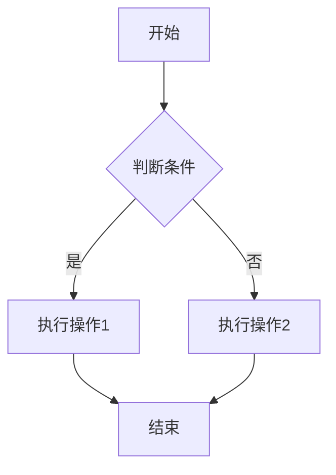

**代码：**

````markdown

````

#### 流程图方向

- `graph TD` - 从上到下
- `graph LR` - 从左到右
- `graph RL` - 从右到左
- `graph BT` - 从下到上

#### 节点形状


**代码：**

````markdown

````

### 3. 时序图 (Sequence Diagram)

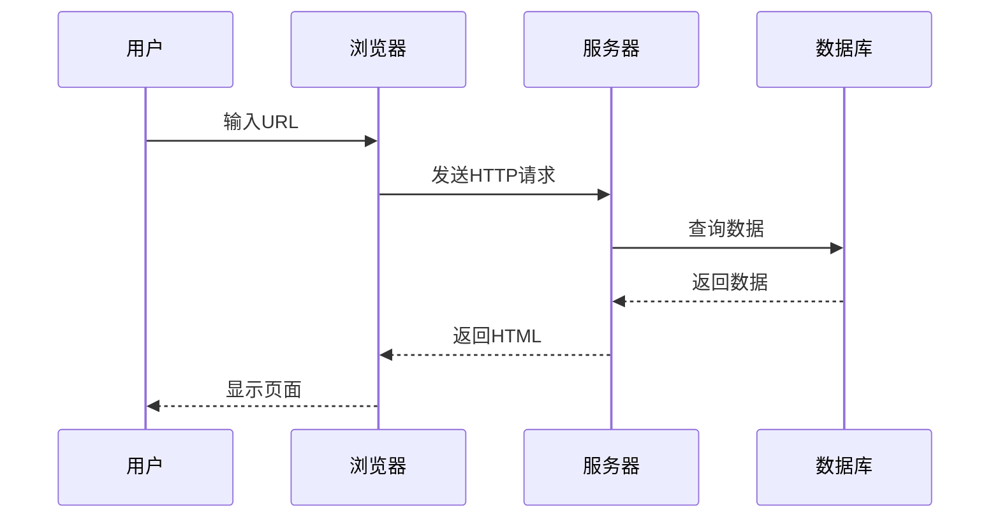

**代码：**

````markdown

````

#### 时序图高级特性

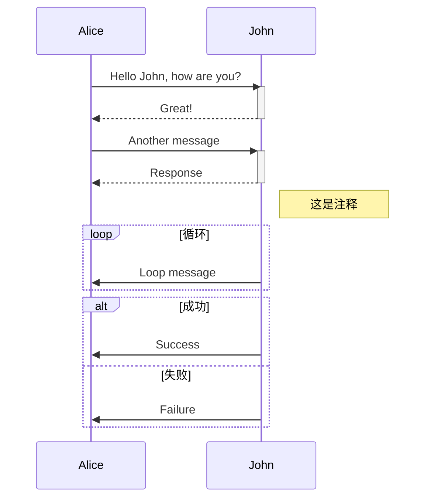

### 4. 类图 (Class Diagram)

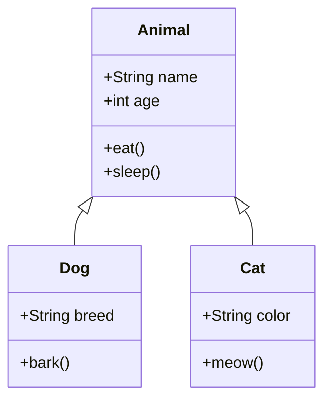

**代码：**

````markdown

````

### 5. 状态图 (State Diagram)

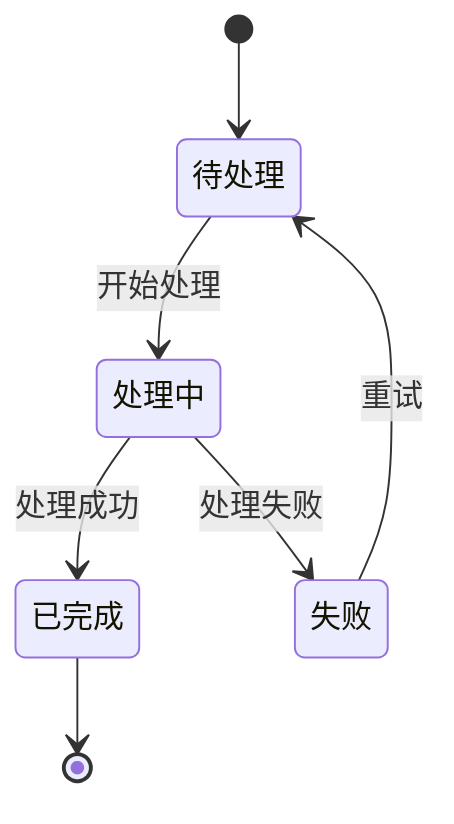

### 6. 甘特图 (Gantt Chart)

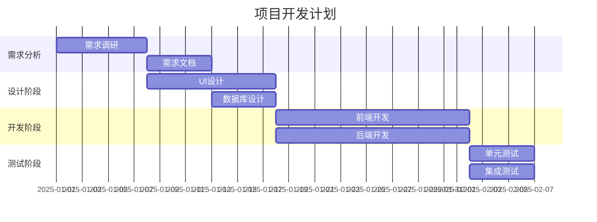

### 7. 饼图 (Pie Chart)

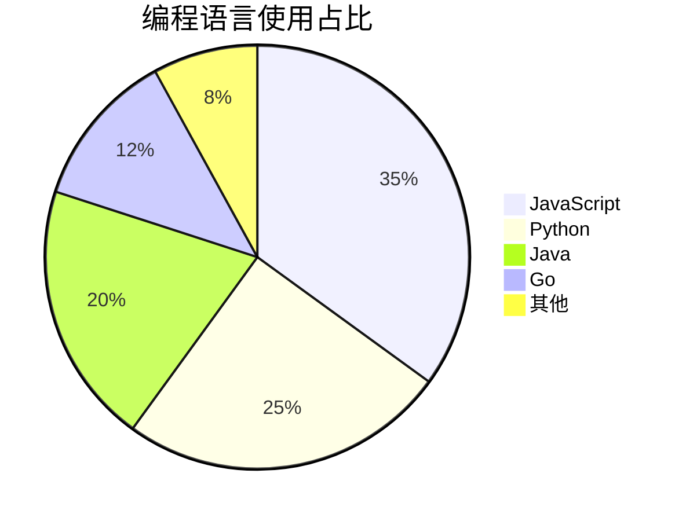

### 8. Git图 (Git Graph)

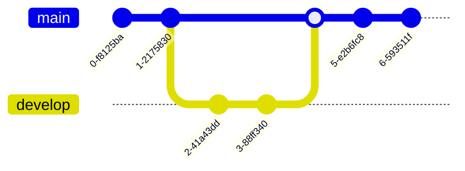

### 9. ER图 (Entity Relationship)

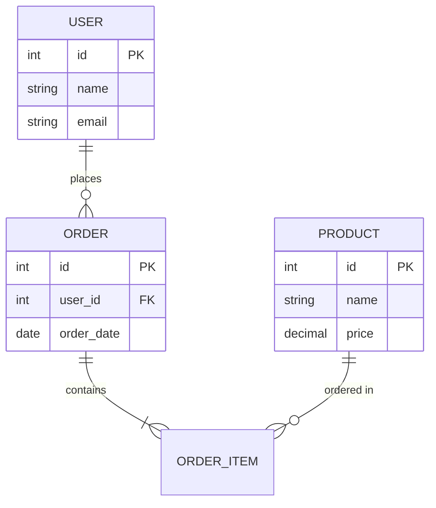

### 10. 用户旅程图

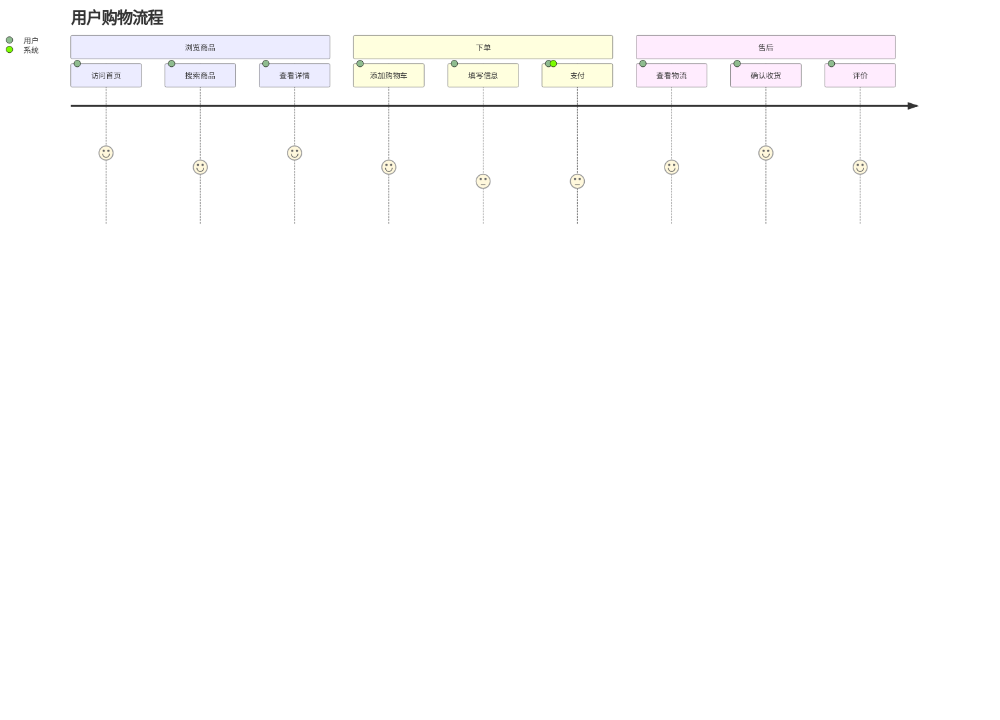

## 三、高级应用场景

### 1. 技术文档模板

```markdown
# API接口文档

## 概述

本文档描述了用户管理相关的API接口。

## 认证方式

所有API请求需要在Header中携带Token：

```http
Authorization: Bearer {token}
```

## 接口列表

### 用户登录

**请求流程：**

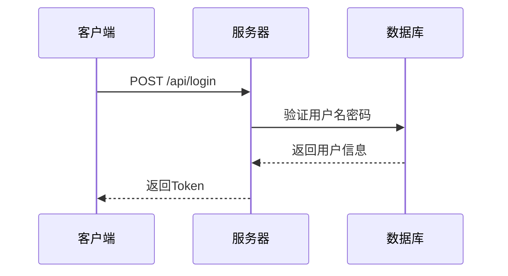

**请求参数：**

| 参数 | 类型 | 必填 | 说明 |
| --- | --- | --- | --- |
| username | string | 是 | 用户名 |
| password | string | 是 | 密码 |

**响应示例：**

```json
{
  "code": 200,
  "data": {
    "token": "eyJhbGciOiJIUzI1NiIsInR5cCI6IkpXVCJ9...",
    "user": {
      "id": 1,
      "username": "admin"
    }
  }
}
```

**状态流转：**

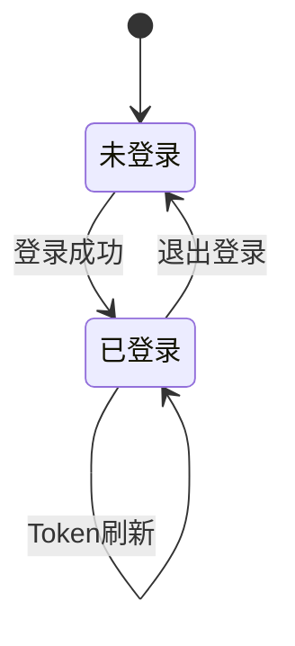
```

### 2. 算法说明文档

```markdown
# 快速排序算法

## 算法原理

快速排序使用分治策略，平均时间复杂度为 $O(n \log n)$。

## 时间复杂度分析

- **最好情况：** $O(n \log n)$
- **平均情况：** $O(n \log n)$
- **最坏情况：** $O(n^2)$

## 空间复杂度

$$
S(n) = O(\log n)
$$

## 算法流程

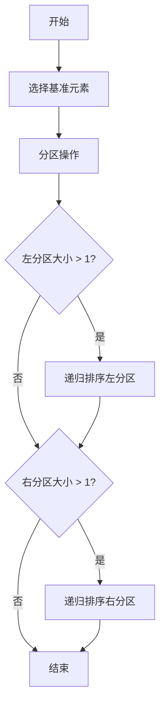

## 代码实现

```javascript
function quickSort(arr, left = 0, right = arr.length - 1) {
    if (left < right) {
        const pivotIndex = partition(arr, left, right);
        quickSort(arr, left, pivotIndex - 1);
        quickSort(arr, pivotIndex + 1, right);
    }
    return arr;
}

function partition(arr, left, right) {
    const pivot = arr[right];
    let i = left - 1;
    
    for (let j = left; j < right; j++) {
        if (arr[j] < pivot) {
            i++;
            [arr[i], arr[j]] = [arr[j], arr[i]];
        }
    }
    
    [arr[i + 1], arr[right]] = [arr[right], arr[i + 1]];
    return i + 1;
}
```

## 性能对比

| 算法 | 平均时间 | 最坏时间 | 空间复杂度 | 稳定性 |
| --- | --- | --- | --- | --- |
| 快速排序 | $O(n \log n)$ | $O(n^2)$ | $O(\log n)$ | 不稳定 |
| 归并排序 | $O(n \log n)$ | $O(n \log n)$ | $O(n)$ | 稳定 |
| 堆排序 | $O(n \log n)$ | $O(n \log n)$ | $O(1)$ | 不稳定 |
```

### 3. 系统架构文档

```markdown
# 微服务架构设计

## 系统架构图

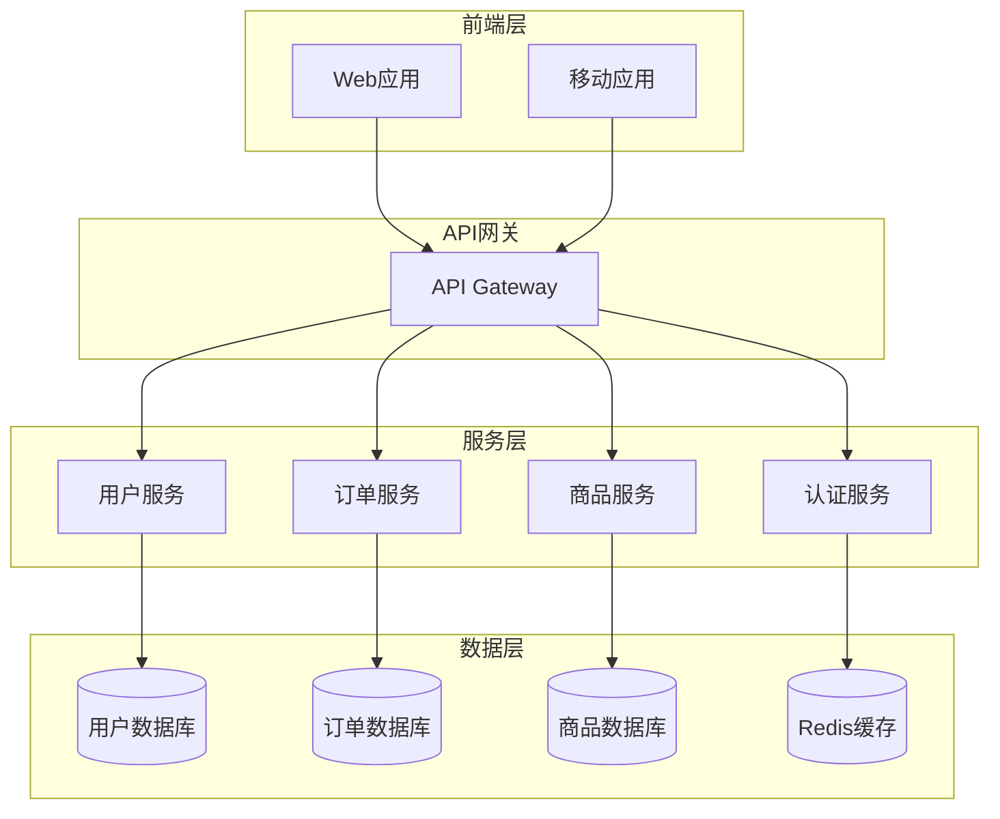

## 数据模型

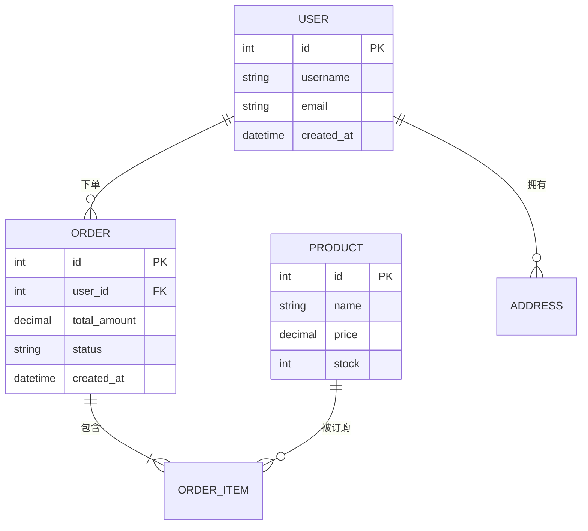

## 部署流程

```mermaid
graph LR
    A[代码提交] --> B[CI构建]
    B --> C[单元测试]
    C --> D{测试通过?}
    D -->|是| E[构建镜像]
    D -->|否| F[通知开发]
    E --> G[推送镜像仓库]
    G --> H[部署到测试环境]
    H --> I[集成测试]
    I --> J{测试通过?}
    J -->|是| K[部署到生产环境]
    J -->|否| F
```
```

## 四、自动化工具与工作流

### 1. Markdown Lint

使用markdownlint检查文档规范：

```bash
npm install -g markdownlint-cli
markdownlint '**/*.md'
```

### 2. 自动生成目录

使用doctoc自动生成目录：

```bash
npm install -g doctoc
doctoc README.md
```

### 3. Markdown转PDF

使用pandoc转换格式：

```bash
pandoc input.md -o output.pdf
```

### 4. 批量处理

使用脚本批量处理Markdown文件：

```bash
#!/bin/bash
for file in *.md; do
    pandoc "$file" -o "${file%.md}.pdf"
done
```

## 五、最佳实践总结

### 1. 文档组织

```
docs/
├── README.md           # 项目概述
├── getting-started.md  # 快速开始
├── api/
│   ├── README.md       # API概述
│   ├── auth.md         # 认证接口
│   └── users.md        # 用户接口
├── guides/
│   ├── installation.md # 安装指南
│   └── deployment.md   # 部署指南
└── reference/
    ├── config.md       # 配置参考
    └── cli.md          # 命令行参考
```

### 2. 命名规范

- 使用小写字母和连字符
- 文件名要有意义
- 避免使用空格和特殊字符

**示例：**
- ✅ `getting-started.md`
- ✅ `api-reference.md`
- ❌ `Getting Started.md`
- ❌ `API参考.md`

### 3. 内容结构

```markdown
# 标题（H1，每个文档只用一次）

简短描述（1-2句话）

## 目录（可选，长文档使用）

## 概述

详细介绍...

## 主要内容

### 子章节1

### 子章节2

## 示例

实际案例...

## 常见问题

Q&A...

## 参考资料

链接列表...
```

### 4. 写作技巧

#### 使用清晰的标题层级

```markdown
# 一级标题 - 文档标题
## 二级标题 - 主要章节
### 三级标题 - 子章节
#### 四级标题 - 详细说明
```

#### 适当使用列表

- 使用无序列表列举要点
- 使用有序列表说明步骤
- 使用任务列表跟踪进度

#### 代码示例要完整

```javascript
// ❌ 不完整的示例
const result = calculate();

// ✅ 完整的示例
function calculate(a, b) {
    return a + b;
}

const result = calculate(1, 2);
console.log(result); // 输出: 3
```

#### 添加视觉元素

- 使用图表说明流程
- 使用表格对比数据
- 使用引用突出重点

### 5. SEO优化

```yaml
---
title: "具体而准确的标题"
description: "简洁的描述，包含关键词"
keywords: "关键词1, 关键词2, 关键词3"
---
```

### 6. 可访问性

- 图片添加alt属性
- 链接使用描述性文字
- 表格添加表头
- 使用语义化的标题层级

## 六、工具推荐

### 编辑器

- **VS Code** + Markdown All in One
- **Typora** - 所见即所得
- **Obsidian** - 知识管理
- **Notion** - 协作文档

### 在线工具

- [StackEdit](https://stackedit.io/) - 在线编辑器
- [Dillinger](https://dillinger.io/) - 实时预览
- [Mermaid Live Editor](https://mermaid.live/) - 图表编辑
- [KaTeX](https://katex.org/) - 公式预览

### 转换工具

- **Pandoc** - 格式转换
- **markdown-pdf** - 转PDF
- **remark** - Markdown处理器

## 七、总结

通过学习本系列教程，你已经掌握了：

### 入门篇
- ✅ Markdown基础语法
- ✅ Front Matter配置
- ✅ 常用元素使用

### 进阶篇
- ✅ GFM扩展语法
- ✅ 任务列表和表情
- ✅ HTML元素集成

### 精通篇
- ✅ 数学公式编写
- ✅ 各类图表绘制
- ✅ 专业文档编写
- ✅ 自动化工作流

## 八、持续学习

### 推荐资源

- [Markdown Guide](https://www.markdownguide.org/)
- [GitHub Docs](https://docs.github.com/en/get-started/writing-on-github)
- [Hugo Documentation](https://gohugo.io/documentation/)
- [Mermaid Documentation](https://mermaid.js.org/)
- [KaTeX Documentation](https://katex.org/docs/supported.html)

### 实践项目

1. 创建个人技术博客
2. 编写开源项目文档
3. 整理学习笔记
4. 制作技术教程

### 社区交流

- GitHub Discussions
- Stack Overflow
- Reddit r/Markdown
- 各类技术论坛

---

**最后的话：** Markdown是一个强大而灵活的工具，掌握它需要不断实践。希望这套教程能帮助你成为Markdown专家！

**系列教程：**
- [Markdown入门教程](/post/markdown/入门/)
- [Markdown进阶教程](/post/markdown/进阶/)
- **Markdown精通教程**（当前）

祝你在技术写作的道路上越走越远！🚀
