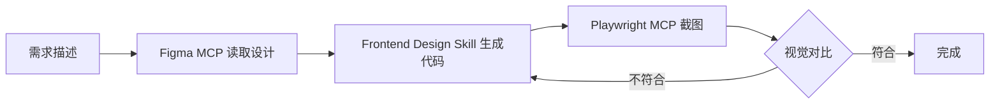

## 核心思路：三个维度增强审美

AI 编程助手（如 Cursor、Codex、Windsurf 等）在前端开发时，审美能力往往是短板。通过以下三个维度的工具组合，可以显著提升 AI 的前端输出质量：

### 1. **审美增强 Skills**
让 AI 具备设计系统、组件库、最佳实践的知识

### 2. **设计输入 MCP**
从 Figma、Sketch 等设计工具直接读取设计稿

### 3. **视觉反馈 MCP**
通过截图、视觉对比验证实现效果

---

## 一、审美增强 Skills

### 1.1 Frontend Design Skill

**适用场景**：通用前端项目，需要现代化 UI 设计

**核心能力**：
- 提供 Tailwind CSS、Material Design、Ant Design 等设计系统的最佳实践
- 响应式布局、无障碍设计、动画效果的标准化建议
- 色彩搭配、字体选择、间距规范

**配置示例**：
```markdown
# .kiro/skills/frontend-design.md
---
name: Frontend Design Expert
description: 提供现代化前端设计建议
---

## 设计原则
1. 遵循 8px 网格系统
2. 使用语义化颜色（primary、success、warning、danger）
3. 保持一致的圆角半径（4px、8px、16px）
4. 响应式断点：sm(640px)、md(768px)、lg(1024px)、xl(1280px)

## 组件设计规范
- 按钮：高度 32px/40px/48px，padding 左右 16px/24px/32px
- 输入框：高度 40px，border-radius 8px
- 卡片：padding 16px/24px，shadow-sm
```

### 1.2 UI Expert MCP

**适用场景**：需要实时查询设计规范、组件库文档

**核心能力**：
- 连接 Storybook、组件库文档
- 查询设计 Token（颜色、字体、间距）
- 获取组件 API 和使用示例

**安装方式**：
```bash
# 假设使用 uvx 安装
uvx ui-expert-mcp
```

**配置示例**：
```json
{
  "mcpServers": {
    "ui-expert": {
      "command": "uvx",
      "args": ["ui-expert-mcp"],
      "env": {
        "STORYBOOK_URL": "https://your-storybook.com",
        "DESIGN_SYSTEM": "material-ui"
      }
    }
  }
}
```

### 1.3 Magic UI Generator

**适用场景**：快速生成现代化 UI 组件

**核心能力**：
- 基于描述生成 React/Vue 组件
- 内置 shadcn/ui、Magic UI 等组件库模板
- 自动生成动画效果和交互逻辑

**使用示例**：
```
"生成一个带渐变背景的 Hero Section，包含标题、副标题和 CTA 按钮"
```

---

## 二、设计输入 MCP

### 2.1 Figma Dev Mode MCP

**适用场景**：设计师使用 Figma，需要设计稿转代码

**核心能力**：
- 读取 Figma 文件的设计 Token（颜色、字体、间距）
- 获取组件的尺寸、样式、层级关系
- 导出切图和 SVG 图标

**配置示例**：
```json
{
  "mcpServers": {
    "figma": {
      "command": "uvx",
      "args": ["figma-mcp"],
      "env": {
        "FIGMA_ACCESS_TOKEN": "your-figma-token",
        "FIGMA_FILE_KEY": "your-file-key"
      }
    }
  }
}
```

**使用流程**：
1. 在 Figma 中标注设计稿（使用 Dev Mode）
2. AI 通过 MCP 读取设计稿数据
3. 生成对应的 HTML/CSS/JSX 代码

### 2.2 Cursor Talk to Figma

**适用场景**：Cursor 用户，需要快速从 Figma 获取设计

**核心能力**：
- 在 Cursor 中直接对话式查询 Figma 设计
- 支持"这个按钮的颜色是什么"、"导航栏的高度是多少"等自然语言查询
- 自动同步设计稿更新

**安装方式**：
```bash
# Cursor 插件市场搜索 "Talk to Figma"
```

---

## 三、小程序专用 MCP & Skills

### 3.1 weapp-dev-mcp

**适用场景**：微信小程序开发

**核心能力**：
- 读取小程序设计规范（rpx 单位、安全区域）
- 查询微信组件库 API
- 生成符合微信审核规范的代码

**配置示例**：
```json
{
  "mcpServers": {
    "weapp-dev": {
      "command": "node",
      "args": ["path/to/weapp-dev-mcp/index.js"],
      "env": {
        "WEAPP_APPID": "your-appid"
      }
    }
  }
}
```

### 3.2 Skyline Skills

**适用场景**：使用微信小程序 Skyline 渲染引擎

**核心能力**：
- Skyline 特有组件的使用建议
- 性能优化（虚拟列表、懒加载）
- 动画效果（Worklet 动画）

**配置示例**：
```markdown
# .kiro/skills/skyline.md
---
name: Skyline Expert
description: 微信小程序 Skyline 渲染引擎专家
---

## Skyline 特性
1. 使用 `<scroll-view>` 替代 `<view>` 实现虚拟列表
2. 使用 Worklet 动画替代 `wx.createAnimation()`
3. 启用 `renderer: "skyline"` 配置
```

---

## 四、视觉反馈 MCP

### 4.1 Playwright MCP

**适用场景**：需要自动化截图对比

**核心能力**：
- 启动浏览器截图
- 对比设计稿和实现效果
- 生成视觉回归测试报告

**配置示例**：
```json
{
  "mcpServers": {
    "playwright": {
      "command": "uvx",
      "args": ["playwright-mcp"]
    }
  }
}
```

**使用流程**：
1. AI 生成前端代码
2. 通过 Playwright MCP 启动浏览器截图
3. AI 对比截图和设计稿，调整代码

### 4.2 Visual Review Skill

**适用场景**：人工审查 + AI 辅助

**核心能力**：
- 提供视觉审查清单（对齐、间距、颜色、字体）
- 生成审查报告模板
- 标注需要修改的位置

**配置示例**：
```markdown
# .kiro/skills/visual-review.md
---
name: Visual Review Checklist
description: 前端视觉审查清单
---

## 审查项
- [ ] 元素对齐（左对齐、居中、右对齐）
- [ ] 间距一致（padding、margin 符合 8px 网格）
- [ ] 颜色准确（与设计稿色值一致）
- [ ] 字体正确（字号、字重、行高）
- [ ] 响应式适配（移动端、平板、桌面端）
```

---

## 五、推荐组合方案

### 方案 1：通用前端项目（React/Vue）

**工具组合**：
- Frontend Design Skill（审美增强）
- Figma Dev Mode MCP（设计输入）
- Playwright MCP（视觉反馈）

**工作流**：
1. 设计师在 Figma 完成设计
2. AI 通过 Figma MCP 读取设计稿
3. AI 根据 Frontend Design Skill 生成代码
4. Playwright MCP 截图对比，AI 调整细节

### 方案 2：微信小程序项目

**工具组合**：
- weapp-dev-mcp（小程序规范）
- Skyline Skills（Skyline 引擎）
- Visual Review Skill（人工审查）

**工作流**：
1. AI 根据 weapp-dev-mcp 生成小程序代码
2. 使用 Skyline Skills 优化性能
3. 开发者工具预览 + Visual Review Skill 审查

### 方案 3：快速原型开发

**工具组合**：
- Magic UI Generator（快速生成）
- UI Expert MCP（查询组件库）
- Cursor Talk to Figma（设计输入）

**工作流**：
1. 用自然语言描述需求
2. Magic UI Generator 生成初版代码
3. 通过 UI Expert MCP 查询组件库优化
4. Cursor Talk to Figma 对齐设计稿

---

## 六、完整配置示例

### Cursor/Codex 配置（.kiro/settings/mcp.json）

```json
{
  "mcpServers": {
    "figma": {
      "command": "uvx",
      "args": ["figma-mcp"],
      "env": {
        "FIGMA_ACCESS_TOKEN": "your-token"
      }
    },
    "playwright": {
      "command": "uvx",
      "args": ["playwright-mcp"]
    },
    "weapp-dev": {
      "command": "node",
      "args": ["path/to/weapp-dev-mcp/index.js"]
    }
  }
}
```

### Skills 配置（.kiro/skills/）

```
.kiro/skills/
├── frontend-design.md      # 前端设计规范
├── skyline.md              # 小程序 Skyline
└── visual-review.md        # 视觉审查清单
```

---

## 七、审美增强工作流

### 标准流程



### 实际对话示例

**开发者**：
```
"根据 Figma 文件 ABC123 的首页设计，生成 React 组件"
```

**AI（使用 Figma MCP + Frontend Design Skill）**：
```jsx
// 读取 Figma 设计稿...
// 检测到：Hero Section，高度 600px，背景渐变 #667eea -> #764ba2

import React from 'react';

export default function Hero() {
  return (
    <section className="h-[600px] bg-gradient-to-r from-[#667eea] to-[#764ba2] flex items-center justify-center">
      <div className="text-center text-white">
        <h1 className="text-5xl font-bold mb-4">欢迎使用我们的产品</h1>
        <p className="text-xl mb-8">让工作更高效</p>
        <button className="bg-white text-[#667eea] px-8 py-3 rounded-lg font-semibold hover:bg-opacity-90 transition">
          立即开始
        </button>
      </div>
    </section>
  );
}
```

**AI（使用 Playwright MCP）**：
```
"已生成代码，正在截图对比..."
"检测到问题：按钮圆角应为 8px，当前为默认值"
"已修复：rounded-lg -> rounded-[8px]"
```

---

## 八、总结对比表格

| 工具类型 | 工具名称 | 适用场景 | 核心能力 | 推荐指数 |
|---------|---------|---------|---------|---------|
| **审美增强** | Frontend Design Skill | 通用前端 | 设计规范、最佳实践 | ⭐⭐⭐⭐⭐ |
| **审美增强** | UI Expert MCP | 组件库项目 | 查询文档、设计 Token | ⭐⭐⭐⭐ |
| **审美增强** | Magic UI Generator | 快速原型 | 生成现代化组件 | ⭐⭐⭐⭐ |
| **设计输入** | Figma Dev Mode MCP | Figma 用户 | 读取设计稿数据 | ⭐⭐⭐⭐⭐ |
| **设计输入** | Cursor Talk to Figma | Cursor 用户 | 对话式查询设计 | ⭐⭐⭐⭐ |
| **小程序** | weapp-dev-mcp | 微信小程序 | 小程序规范、API | ⭐⭐⭐⭐⭐ |
| **小程序** | Skyline Skills | Skyline 引擎 | 性能优化、动画 | ⭐⭐⭐⭐ |
| **视觉反馈** | Playwright MCP | 自动化测试 | 截图对比、回归测试 | ⭐⭐⭐⭐⭐ |
| **视觉反馈** | Visual Review Skill | 人工审查 | 审查清单、报告 | ⭐⭐⭐ |

---

## 九、常见问题

### Q1：这些工具都是免费的吗？

**A**：
- **免费**：Frontend Design Skill、Visual Review Skill、Skyline Skills（自建）
- **部分免费**：Figma MCP（需 Figma 账号）、Playwright MCP（开源）
- **付费**：Magic UI Generator（部分功能）、UI Expert MCP（取决于服务商）

### Q2：如何选择适合自己的组合？

**A**：
- **预算有限**：Frontend Design Skill + Playwright MCP
- **团队协作**：Figma Dev Mode MCP + Visual Review Skill
- **快速开发**：Magic UI Generator + UI Expert MCP
- **小程序项目**：weapp-dev-mcp + Skyline Skills

### Q3：这些工具会替代设计师吗？

**A**：不会。这些工具是**辅助**开发者更好地还原设计稿，而不是替代设计师的创意工作。设计师仍然负责：
- 用户体验设计
- 视觉风格定义
- 交互逻辑设计

---

## 十、参考资源

- [Figma Dev Mode 官方文档](https://www.figma.com/dev-mode/)
- [Playwright 官方文档](https://playwright.dev/)
- [微信小程序 Skyline 文档](https://developers.weixin.qq.com/miniprogram/dev/framework/runtime/skyline/)
- [shadcn/ui 组件库](https://ui.shadcn.com/)
- [Magic UI 组件库](https://magicui.design/)

---

**最后更新**：2026-05-14  
**作者**：JJX  
**标签**：#AI开发 #MCP #Skills #前端开发 #UI设计
