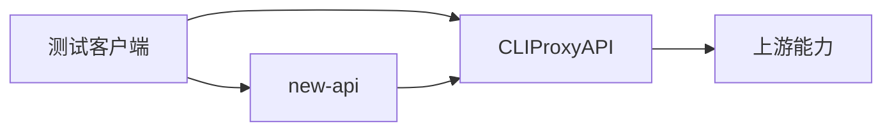

如果你已经大致理解了 `CLIProxyAPI` 和 `new-api` 的角色区别，下一步真正影响成败的，通常不是概念，而是接口联调本身能不能走通。

<!--more-->

这篇文章只做一件事：把 `CLIProxyAPI -> new-api -> 客户端` 这条链路拆开，按最容易成功的顺序做验证和排错。

## 一、先说联调原则

联调这件事最容易犯的错，就是一下子把所有层都接上，然后出了问题完全不知道是哪一层坏了。

更稳的原则只有两条：

1. 先直连 `CLIProxyAPI`
2. 再通过 `new-api`

也就是说，排错顺序必须是：

```text
先证明代理层可用
再证明网关层可用
最后再接真实客户端
```

只要顺序反了，定位问题的成本通常会直接翻倍。

---

## 二、联调前的最小准备

正式开始之前，建议先确认你手里已经有下面这些信息：

- `CLIProxyAPI` 的监听地址
- `new-api` 的监听地址
- 一个已经配置好的模型名
- 对应的访问 key
- 一个能发 HTTP 请求的工具

为了后面命令更好替换，建议先在脑子里记住这几个变量：

```text
CLI_PROXY_BASE=http://127.0.0.1:你的端口
NEW_API_BASE=http://127.0.0.1:你的端口
CLI_PROXY_KEY=你的 CLIProxyAPI 密钥
NEW_API_KEY=你的 new-api 密钥
MODEL_NAME=你的模型名
```

注意这里的值不要照抄示例。  
端口、密钥和模型名一定要以你自己的配置为准。

---

## 三、联调的正确顺序

从实战角度，我建议按这四步来：

### 3.1 第一步：只测 CLIProxyAPI

这一步的目标是证明：

- 服务已经启动
- 端口能访问
- key 能认证
- 模型名能识别
- 返回格式正常

### 3.2 第二步：只测 new-api 到 CLIProxyAPI

这一步的目标是证明：

- `new-api` 的上游配置正确
- `new-api` 的 key 和模型映射正确
- `new-api` 能成功把请求转发给 `CLIProxyAPI`

### 3.3 第三步：比较两边响应

这一步不是单纯看“能不能返回”，而是对比：

- 是否都能返回
- 模型名是否一致
- 响应结构是否一致
- 流式和非流式行为是否一致

### 3.4 第四步：再接真实客户端

等前面三步都稳定以后，再让：

- 终端工具
- SDK
- 你的应用

去接 `new-api`。

这时候如果仍有问题，基本就可以把范围缩到客户端侧，而不是服务链路本身。

---

## 四、先直连 CLIProxyAPI

### 4.1 用 curl 做最小化测试

如果你有 `curl`，先跑一条最小请求：

```bash
curl http://127.0.0.1:你的端口/v1/chat/completions \
  -H "Content-Type: application/json" \
  -H "Authorization: Bearer 你的密钥" \
  -d '{
    "model": "你的模型名",
    "messages": [
      {
        "role": "user",
        "content": "请回复：CLIProxyAPI 直连已成功"
      }
    ],
    "stream": false
  }'
```

如果成功，你通常应该能看到一个标准的兼容响应对象。

如果失败，优先看这几类问题：

- 连接失败：通常是端口、监听地址或服务未启动
- `401`：通常是 key 不对
- `404`：通常是路径不对
- 模型错误：通常是 `model` 名不对

### 4.2 用 PowerShell 做最小化测试

如果你在 Windows 下联调，PowerShell 往往更直接：

```powershell
$body = @{
    model = "你的模型名"
    messages = @(
        @{
            role = "user"
            content = "请回复：CLIProxyAPI PowerShell 直连已成功"
        }
    )
    stream = $false
} | ConvertTo-Json -Depth 10

Invoke-RestMethod -Uri "http://127.0.0.1:你的端口/v1/chat/completions" `
    -Method POST `
    -Headers @{
        "Authorization" = "Bearer 你的密钥"
    } `
    -Body $body `
    -ContentType "application/json"
```

PowerShell 的好处是返回结果会自动转成对象，查看字段更方便。

### 4.3 这一步必须确认什么

在进入下一步之前，至少要确认：

- `CLIProxyAPI` 能稳定返回
- 认证已经通过
- 模型名是正确的
- 非流式请求工作正常

如果这一步还没通，不要继续接 `new-api`。

---

## 五、再通过 new-api 测试

等你已经确认 `CLIProxyAPI` 可用以后，再把测试入口换成 `new-api`。

### 5.1 用 curl 测试 new-api

```bash
curl http://127.0.0.1:你的端口/v1/chat/completions \
  -H "Content-Type: application/json" \
  -H "Authorization: Bearer 你的 new-api key" \
  -d '{
    "model": "你在 new-api 中映射后的模型名",
    "messages": [
      {
        "role": "user",
        "content": "请回复：new-api 转发已成功"
      }
    ],
    "stream": false
  }'
```

如果这一步失败，但上一步直连成功，问题大概率就在 `new-api` 层。

优先检查：

- `new-api` 的上游地址是否填对
- `new-api` 的模型映射是否正确
- `new-api` 的 key 是否可用
- `new-api` 是否真的把请求转发到了 `CLIProxyAPI`

### 5.2 用 PowerShell 测试 new-api

```powershell
$body = @{
    model = "你在 new-api 中映射后的模型名"
    messages = @(
        @{
            role = "user"
            content = "请回复：new-api PowerShell 转发已成功"
        }
    )
    stream = $false
} | ConvertTo-Json -Depth 10

Invoke-RestMethod -Uri "http://127.0.0.1:你的端口/v1/chat/completions" `
    -Method POST `
    -Headers @{
        "Authorization" = "Bearer 你的 new-api key"
    } `
    -Body $body `
    -ContentType "application/json"
```

这一条的意义和 `curl` 一样，只是更适合在 Windows 本机排查。

---

## 六、怎么比较两边结果

联调里最关键的一步，不只是“返回了”，而是“返回得对不对”。

建议你至少比较下面这些点：

### 6.1 返回结构

重点看：

- 是否都有 `choices`
- 是否都有 `message`
- 是否返回了兼容格式

### 6.2 模型名

重点看：

- `CLIProxyAPI` 直连时用的模型名
- `new-api` 里映射后的模型名

很多“明明能调通但结果不对”的问题，最后都落在这里。

### 6.3 非流式和流式

建议分开测：

- `stream: false`
- `stream: true`

因为有些链路是非流式正常、流式异常。

### 6.4 错误码和报错文本

如果两边都失败，就看是不是同一个报错。  
如果只有 `new-api` 失败，通常说明问题不在上游，而在映射、权限或转发。

---

## 七、流式联调怎么测

如果你要给终端工具或 CLI 用，流式输出必须单独测一次。

### 7.1 最简单的方法

把请求里的：

```json
"stream": false
```

改成：

```json
"stream": true
```

然后观察：

- 是否持续输出分片
- 是否中途断流
- `new-api` 转发后是否仍保留流式行为

### 7.2 流式联调最容易出的问题

常见情况通常是：

- 直连 `CLIProxyAPI` 有流式
- 经过 `new-api` 没流式

这时候优先怀疑：

- `new-api` 的上游兼容配置
- 客户端是不是本身没正确处理流
- 中间代理层是否做了缓冲

---

## 八、最常见的报错怎么定位

下面这些问题最常见。

### 8.1 连不上接口

表现：

- 超时
- connection refused
- 无法建立连接

优先排查：

- 服务是否已经启动
- 端口是否正确
- 地址是否正确
- 防火墙或反向代理是否拦截

### 8.2 `401 Unauthorized`

表现：

- key 不合法
- 认证失败

优先排查：

- Bearer token 是否写对
- 用的是 `CLIProxyAPI` 的 key 还是 `new-api` 的 key
- 是否把两层的 key 混用了

### 8.3 `404 Not Found`

表现：

- 路径不对
- 路由不存在

优先排查：

- 是否用了 `/v1/chat/completions`
- 是否请求到了正确的服务地址
- 是否把某一层的路径写错

### 8.4 模型不存在

表现：

- model not found
- invalid model

优先排查：

- `CLIProxyAPI` 里真实可用的模型名
- `new-api` 里映射出来给用户的模型名
- 有没有把上游模型名和对外模型名搞混

### 8.5 直连成功，转发失败

这是最典型的一类问题。

说明：

- 上游基本没问题
- `CLIProxyAPI` 基本没问题
- 问题集中在 `new-api`

优先排查：

- 上游地址
- 模型映射
- 渠道路由
- key 权限

---

## 九、推荐的排错顺序

如果你只记一个流程，就记这个：

1. 确认 `CLIProxyAPI` 已启动
2. 直连 `CLIProxyAPI`，直到成功
3. 确认 `new-api` 已启动
4. 在 `new-api` 中确认上游配置和模型映射
5. 通过 `new-api` 发同一条请求
6. 比较两边返回差异
7. 最后再接你的终端工具或应用

这套顺序的最大价值，是每一步都能把责任边界切清楚。

---

## 十、一个推荐的联调拓扑

如果你在本机测试，最容易理解的结构通常是：



你可以把它理解成两条路：

- 路线一：客户端直连 `CLIProxyAPI`
- 路线二：客户端通过 `new-api` 再到 `CLIProxyAPI`

联调时就是拿同一类请求分别走这两条路，然后看差异。

---

## 十一、什么时候算联调成功

至少要满足下面这些条件：

- 直连 `CLIProxyAPI` 能成功
- 通过 `new-api` 也能成功
- 非流式返回正常
- 流式返回正常
- 模型映射符合预期
- 客户端接入后行为一致

如果只是“偶尔能返回”，那不算真正联调完成。

---

## 十二、总结

`CLIProxyAPI + new-api` 联调最重要的，不是命令多复杂，而是顺序要对：

- 先通 `CLIProxyAPI`
- 再通 `new-api`
- 最后接真实客户端

只要你始终按这个顺序排查，绝大多数问题都能很快缩到某一层，而不会在整条链路里盲猜。

---

## 相关文档

- [EasyCLI、CLIProxyAPI 和 new-api 的区别与使用指南](./EasyCLI、CLIProxyAPI%20和%20new-api%20的区别与使用指南.md)
- [终端调用 API 详解](./终端调用API详解.md)

## 参考资料

- CLIProxyAPI: <https://github.com/router-for-me/CLIProxyAPI>
- new-api: <https://github.com/QuantumNous/new-api>
