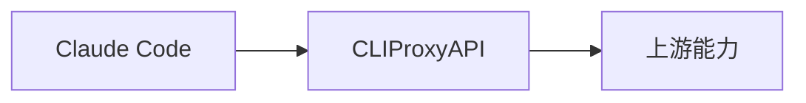

如果你的目标是让 `Claude Code` 不直接连 Anthropic 官方接口，而是通过 `CLIProxyAPI` 这样的代理层走请求，那真正关键的不是“能不能设置一个代理地址”，而是 Claude Code 的认证头、模型名、Beta 头和流式行为，是否都能和代理兼容。

<!--more-->

这篇文章就按 Windows 本机环境来写，重点讲一条最容易联调成功的路径。

## 一、先说结论

截至 `2026-04-10`，我在这台机器上本机确认到：

- `claude --version` 返回 `2.1.75 (Claude Code)`
- `claude --help` 显示支持 `-p/--print` 非交互输出
- 本机 `~/.claude/settings.json` 已存在 `env` 配置结构

Anthropic 官方文档同时明确说明：

- `ANTHROPIC_AUTH_TOKEN` 可以自定义 `Authorization` 头
- `ANTHROPIC_BASE_URL` 可以覆盖 API endpoint，把请求路由到 proxy 或 gateway
- 当 `ANTHROPIC_BASE_URL` 指向非官方 host 时，MCP tool search 默认会被禁用

来源：

- <https://code.claude.com/docs/en/env-vars>
- <https://code.claude.com/docs/en/settings>

所以从工程上讲，`Claude Code -> CLIProxyAPI -> 上游能力` 这条链路是成立的。



---

## 二、开始前要准备什么

在本机联调之前，建议先确认下面这些条件：

- 已安装 `Claude Code`
- 已安装并运行 `CLIProxyAPI`
- `CLIProxyAPI` 已暴露可用接口
- 你手里有 `CLIProxyAPI` 可识别的 token 或 key
- 你知道代理层实际暴露出来的模型名

先在 PowerShell 里执行：

```powershell
claude --version
claude --help
```

如果要先确认代理层是不是活着，再测一条最小请求：

```bash
curl http://127.0.0.1:你的端口/v1/models \
  -H "Authorization: Bearer 你的代理 token"
```

如果模型列表都还拿不到，不要急着去配 `Claude Code`。

---

## 三、Claude Code 是怎么接代理的

Anthropic 官方环境变量文档给了最核心的两个入口：

- `ANTHROPIC_AUTH_TOKEN`
- `ANTHROPIC_BASE_URL`

官方文档含义是：

- `ANTHROPIC_AUTH_TOKEN`：自定义 `Authorization` 头，Claude Code 会自动加上 `Bearer `
- `ANTHROPIC_BASE_URL`：覆盖默认 API endpoint，把请求转发到你自己的 proxy 或 gateway

来源：

- <https://code.claude.com/docs/en/env-vars>

而我本机 `~/.claude/settings.json` 里也已经确认到，Claude Code 的用户级配置支持：

```json
{
  "env": {
    "ANTHROPIC_AUTH_TOKEN": "你的值",
    "ANTHROPIC_BASE_URL": "你的代理地址"
  }
}
```

注意，这里上面只是结构示例，不是建议你把真实密钥明文贴到文章里那样存。

---

## 四、推荐的配置方式

### 4.1 直接改 `~/.claude/settings.json`

如果你希望 Claude Code 所有会话都默认走 `CLIProxyAPI`，最直接的方式就是改：

```text
~/.claude/settings.json
```

可参考下面这个模板：

```json
{
  "env": {
    "ANTHROPIC_AUTH_TOKEN": "你的代理 token",
    "ANTHROPIC_BASE_URL": "http://127.0.0.1:你的端口"
  },
  "includeCoAuthoredBy": false
}
```

这里的关键点是：

- `ANTHROPIC_AUTH_TOKEN` 给的是代理层要识别的 token
- `ANTHROPIC_BASE_URL` 给的是代理入口，不是 Anthropic 官方地址

### 4.2 为什么这里不是 `ANTHROPIC_API_KEY`

Anthropic 官方文档里同时列了：

- `ANTHROPIC_API_KEY`
- `ANTHROPIC_AUTH_TOKEN`

但从 Claude Code 的行为看：

- `ANTHROPIC_API_KEY` 会发成 `X-Api-Key`
- `ANTHROPIC_AUTH_TOKEN` 会发成 `Authorization: Bearer ...`

如果你的 `CLIProxyAPI` 更偏向 Bearer token 识别，通常优先用 `ANTHROPIC_AUTH_TOKEN` 更直接。

如果你的代理明确要求的是 API key 头，再考虑 `ANTHROPIC_API_KEY`。

### 4.3 代理地址要不要带路径

这一步一定不要想当然。

最稳的做法是：

1. 先看 `CLIProxyAPI` 文档或你自己的配置
2. 确认 Claude Code 请求应该落到哪个 base URL
3. 以你代理实际要求为准

也就是说：

- 有的代理要求根路径
- 有的代理要求带上特定前缀

这件事必须以你的代理实现为准，不能把别的客户端的路径规则硬套过来。

---

## 五、第一次联调怎么测

不要一上来就开交互式重任务。  
最稳的是先做非交互最小测试。

### 5.1 用 `claude -p` 做最小验证

本机 `claude --help` 已确认支持：

```text
-p, --print
```

所以你可以先跑：

```powershell
claude -p "请回复：Claude Code 已通过 CLIProxyAPI 连通"
```

如果配置正确，这条命令就应该能直接走你设置好的代理出口。

### 5.2 如果你想看更结构化的输出

当前版本还支持：

```text
--output-format json
```

所以也可以这样测：

```powershell
claude -p --output-format json "请回复：Claude Code JSON 测试成功"
```

这样更方便你判断：

- 是请求根本没发出去
- 还是返回格式不兼容

### 5.3 如果你要显式指定模型

本机 `claude --help` 也确认支持：

```text
--model <model>
```

所以可以加上：

```powershell
claude -p --model "你的模型名" "请回复：指定模型测试成功"
```

这里的模型名必须是代理层真正支持的那个名字。

---

## 六、一个更稳的接入顺序

为了少踩坑，我建议按下面顺序走：

1. 先确认 `CLIProxyAPI` 已启动
2. 用 `curl /models` 验证代理层可用
3. 修改 `~/.claude/settings.json`
4. 重开一个终端会话
5. 用 `claude -p` 做最小测试
6. 再用 `claude -p --model ...` 指定模型测试
7. 最后再进入交互式 `claude`

只要前面每一步都是分开的，后面出问题时就很容易知道是哪层坏了。

---

## 七、Claude Code 走代理时最容易踩的坑

这部分比配置本身更重要。

### 7.1 Beta 头不兼容

Anthropic 官方环境变量文档里明确提到：

- 如果代理或网关拒绝某些 `anthropic-beta` 头
- 可以设置 `CLAUDE_CODE_DISABLE_EXPERIMENTAL_BETAS=1`

来源：

- <https://code.claude.com/docs/en/env-vars>

也就是说，如果你遇到这类错误：

```text
Unexpected value(s) for the anthropic-beta header
```

或者代理返回类似“Extra inputs are not permitted”，就优先考虑加：

```json
{
  "env": {
    "CLAUDE_CODE_DISABLE_EXPERIMENTAL_BETAS": "1"
  }
}
```

### 7.2 流式失败后非流式回退异常

官方文档还提供了：

- `CLAUDE_CODE_DISABLE_NONSTREAMING_FALLBACK`

它的作用是：

- 当 streaming 失败时
- 禁用自动退回 non-streaming 的 fallback

来源：

- <https://code.claude.com/docs/en/env-vars>

如果你的代理层在 streaming 上兼容性不稳定，这个变量很值得知道。

### 7.3 非官方 host 默认禁用 MCP tool search

Anthropic 官方文档明确写到：

- 当 `ANTHROPIC_BASE_URL` 指向非 first-party host 时
- MCP tool search 默认会被禁用

来源：

- <https://code.claude.com/docs/en/env-vars>

这意味着：

- 你通过代理跑通基本聊天，不代表所有 Claude Code 功能都百分百照旧
- 某些依赖第一方行为的功能，需要单独验证

---

## 八、一份更贴近实战的配置模板

如果你只是为了让 Claude Code 先通过 CLIProxyAPI 跑起来，建议先用最克制的配置：

```json
{
  "env": {
    "ANTHROPIC_AUTH_TOKEN": "your_proxy_token",
    "ANTHROPIC_BASE_URL": "http://127.0.0.1:8317",
    "CLAUDE_CODE_DISABLE_EXPERIMENTAL_BETAS": "1"
  },
  "includeCoAuthoredBy": false
}
```

这份配置的思路是：

- 先只解决认证
- 先只解决代理地址
- 先把最容易引发兼容问题的实验性 Beta 头关掉

等最小链路跑通以后，再决定要不要恢复默认行为。

---

## 九、常见问题排查

### 9.1 `claude -p` 直接失败

优先排查：

- `CLIProxyAPI` 是否真的在运行
- `ANTHROPIC_BASE_URL` 是否写对
- `ANTHROPIC_AUTH_TOKEN` 是否写对

### 9.2 代理层能返回模型列表，但 Claude Code 不工作

优先排查：

- Claude Code 是否读取到了新的 `settings.json`
- 终端是否已经重开
- 代理层是否兼容 Claude Code 的请求路径和头部

### 9.3 返回 401 或 403

优先排查：

- Bearer token 是否正确
- 代理层要求的是不是别的头
- `ANTHROPIC_AUTH_TOKEN` 和 `ANTHROPIC_API_KEY` 是否用混了

### 9.4 返回 400，提示 Beta 或参数不兼容

优先排查：

- 是否需要设置 `CLAUDE_CODE_DISABLE_EXPERIMENTAL_BETAS=1`
- 代理层是否不支持某些 Anthropic 扩展字段
- 模型是否不支持当前 effort / thinking 参数

### 9.5 交互式能用，`-p` 不能用，或者反过来

优先排查：

- 非交互模式和交互模式是否走了不同的认证优先级
- 当前会话是否缓存了旧配置
- 命令行是否显式指定了 `--model`

---

## 十、本机已确认事实和工程推断

为了避免你把“我机器上刚好能这样”误当成“所有版本都永远如此”，这里把边界写清楚。

### 10.1 本机已确认事实

截至 `2026-04-10`，本机已直接确认到：

- `claude --version` 返回 `2.1.75 (Claude Code)`
- `claude --help` 支持 `-p`、`--output-format`、`--model`
- `~/.claude/settings.json` 支持 `env`
- 本机用户级配置里已实际使用过 `ANTHROPIC_AUTH_TOKEN` 和 `ANTHROPIC_BASE_URL`

### 10.2 基于官方文档和本机环境的工程推断

下面这些属于高可信的工程推断：

- Claude Code 可以通过 `ANTHROPIC_BASE_URL` 走非官方代理入口
- 只要代理层正确处理 Authorization 和请求协议，Claude Code 可以通过 CLIProxyAPI 联调成功

但如果你后面升级 Claude Code，环境变量支持面和默认行为仍建议再看一次官方文档。

---

## 十一、总结

`CLIProxyAPI 接 Claude Code` 这件事，真正决定成功率的不是“会不会写 settings.json”，而是：

- 认证头对不对
- 代理地址对不对
- 模型名对不对
- Beta 和 streaming 兼容性对不对

所以最稳的路径始终是：

1. 先确认代理层可用
2. 再通过 `ANTHROPIC_AUTH_TOKEN + ANTHROPIC_BASE_URL` 接 Claude Code
3. 先用 `claude -p` 做最小联调
4. 最后再进交互式会话

---

## 相关文档

- [EasyCLI、CLIProxyAPI 和 new-api 的区别与使用指南](./EasyCLI、CLIProxyAPI%20和%20new-api%20的区别与使用指南.md)
- [CLIProxyAPI 与 new-api 接口联调实战](./CLIProxyAPI%20与%20new-api%20接口联调实战.md)
- [CLIProxyAPI 接入 Codex CLI 实战](./CLIProxyAPI%20接入%20Codex%20CLI%20实战.md)

## 参考资料

- Claude Code settings: <https://code.claude.com/docs/en/settings>
- Claude Code environment variables: <https://code.claude.com/docs/en/env-vars>
- CLIProxyAPI: <https://github.com/router-for-me/CLIProxyAPI>
