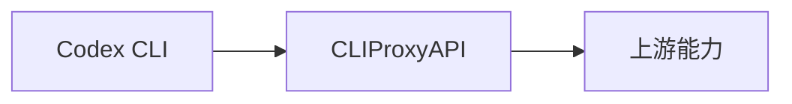

如果你的目标是让 `Codex CLI` 不直接连官方接口，而是先走 `CLIProxyAPI`，那最稳的做法不是先猜环境变量，而是先把 `Codex CLI` 本机配置方式和 `CLIProxyAPI` 暴露出来的兼容接口同时确认清楚。

<!--more-->

这篇文章就按这个顺序来，直接走一套更容易成功的联调路径。

## 一、先说结论

在 `2026-04-10` 这台机器上，我本机确认到的 `Codex CLI` 版本是：

```text
codex-cli 0.118.0
```

同时，本机 `codex --help` 和本地配置文件显示，当前这版 `Codex CLI` 可以通过 `~/.codex/config.toml` 中的自定义 provider 来接一个 OpenAI 兼容入口。

也就是说，整条链路可以理解成：



如果你后面还要接 `new-api`，那只是再多一层网关；但 `Codex CLI` 本身先接通 `CLIProxyAPI` 才是第一步。

---

## 二、开始前要准备什么

在 Windows 本机环境里，至少要有下面这些东西：

- 已安装 `Codex CLI`
- 已安装并可运行 `CLIProxyAPI`
- 一个 `CLIProxyAPI` 可识别的访问 key
- 一个 `CLIProxyAPI` 暴露出来的模型名

如果你要先检查本机 `Codex CLI` 是否存在，可以执行：

```powershell
codex --version
codex --help
```

在我当前机器上，`codex --help` 已确认存在下面这些关键命令：

- `codex login`
- `codex exec`
- `codex logout`

这意味着后面可以分别做：

- key 登录
- 非交互测试
- 退出并重登

---

## 三、先确认 CLIProxyAPI 自己能工作

在接 `Codex CLI` 之前，不要跳过这一步。

### 3.1 先测模型列表

先确认 `CLIProxyAPI` 确实在监听，并且能返回模型列表：

```bash
curl http://127.0.0.1:你的端口/v1/models \
  -H "Authorization: Bearer 你的代理 key"
```

你在这里主要看两件事：

- 接口是否能访问
- 返回里是否包含你准备给 `Codex CLI` 使用的模型名

### 3.2 再测一次最小对话请求

```bash
curl http://127.0.0.1:你的端口/v1/chat/completions \
  -H "Content-Type: application/json" \
  -H "Authorization: Bearer 你的代理 key" \
  -d '{
    "model": "你的模型名",
    "messages": [
      {
        "role": "user",
        "content": "请回复：CLIProxyAPI 已可用于 Codex CLI"
      }
    ],
    "stream": false
  }'
```

如果这一步还没通，不要继续配 `Codex CLI`。  
因为这说明问题根本不在 `Codex CLI`，而在代理层本身。

---

## 四、Codex CLI 当前版本怎么接自定义代理

这一部分是本文最关键的内容。

### 4.1 本机确认到的配置方式

我在本机读取到的 `~/.codex/config.toml` 里，已经存在一套可以工作的自定义 provider 结构，字段名是这些：

```toml
model = "gpt-5.4"
model_provider = "custom"

[model_providers.custom]
base_url = "http://127.0.0.1:8327/v1"
name = "custom"
requires_openai_auth = true
wire_api = "responses"
```

这说明当前版本的 `Codex CLI` 至少支持：

- `model`
- `model_provider`
- `[model_providers.<name>]`
- `base_url`
- `requires_openai_auth`
- `wire_api`

这里不是猜测，是本机现有配置里真实存在的键名。

### 4.2 一份更通用的配置模板

你可以先按下面这个结构改自己的 `~/.codex/config.toml`：

```toml
model = "你的模型名"
model_provider = "custom"

[model_providers.custom]
base_url = "http://127.0.0.1:你的端口/v1"
name = "custom"
requires_openai_auth = true
wire_api = "responses"
```

这里有几个关键点：

- `base_url` 指向的是 `CLIProxyAPI` 的 `/v1`
- `model` 要填 `CLIProxyAPI` 实际暴露出来的模型名
- `requires_openai_auth = true` 表示它会按 OpenAI 风格认证

### 4.3 为什么不要一开始就写复杂配置

因为你现在的目标只是让 `Codex CLI -> CLIProxyAPI` 先通。

这一步不需要：

- 多 profile
- 多 provider 混用
- 复杂别名策略

配置越复杂，越难看出到底是哪一层出了问题。

---

## 五、怎么给 Codex CLI 配认证

根据本机 `codex login --help`，当前版本支持：

```text
codex login --with-api-key
```

这个命令会从标准输入读取 key。

### 5.1 最直接的登录方式

在 PowerShell 中，你可以这样做：

```powershell
"你的代理 key" | codex login --with-api-key
```

如果你之前已经登录过旧的凭据，也可以先清掉：

```powershell
codex logout
```

然后再重新执行：

```powershell
"你的代理 key" | codex login --with-api-key
```

### 5.2 登录后怎么确认状态

你可以再执行：

```powershell
codex login status
```

如果状态正常，说明 `Codex CLI` 至少已经拿到了认证信息。

---

## 六、第一次联调建议怎么测

不要一上来就开交互式大任务。  
更稳的是先用 `codex exec` 做一次最小验证。

### 6.1 用 codex exec 做最小请求

先在一个普通项目目录里执行：

```powershell
codex exec "用一句话回复：Codex CLI 已通过 CLIProxyAPI 连通"
```

如果你想显式指定模型，也可以加：

```powershell
codex exec -m "你的模型名" "用一句话回复：Codex CLI 已通过 CLIProxyAPI 连通"
```

这里的目标只有一个：确认 `Codex CLI` 能真正通过你配置的 `custom` provider 请求出去。

### 6.2 如果你想避免持久化会话

当前版本的 `codex exec --help` 还显示支持：

```text
--ephemeral
```

所以你也可以这样测：

```powershell
codex exec --ephemeral "用一句话回复：临时会话测试成功"
```

这更适合联调阶段。

---

## 七、一个推荐的完整接入顺序

如果你想少踩坑，我建议按这个顺序做：

1. 先启动 `CLIProxyAPI`
2. 用 `curl` 验证 `/v1/models`
3. 用 `curl` 验证 `/v1/chat/completions`
4. 修改 `~/.codex/config.toml`
5. 用 `codex logout` 清理旧凭据
6. 用 `codex login --with-api-key` 写入代理 key
7. 用 `codex login status` 确认状态
8. 用 `codex exec` 做最小联调
9. 最后再进入交互式 `codex`

这条顺序最大的好处，是每一步都能清楚知道是谁出了问题。

---

## 八、一个更贴近实战的配置示例

下面给一份更完整但仍然克制的示例：

```toml
disable_response_storage = true
model = "gpt-5.4"
model_provider = "custom"
model_reasoning_effort = "high"
personality = "pragmatic"

[model_providers.custom]
base_url = "http://127.0.0.1:8327/v1"
name = "custom"
requires_openai_auth = true
wire_api = "responses"
```

这份配置的思路是：

- 保持只有一个 provider
- 明确默认模型
- 明确走代理地址
- 尽量减少联调变量

你后面真要做多 provider、多 profile，再往上叠。

---

## 九、常见问题怎么排查

### 9.1 codex login 正常，但 codex exec 失败

优先排查：

- `base_url` 是否正确
- `model` 是否是 `CLIProxyAPI` 真正暴露的模型名
- `CLIProxyAPI` 是否仍在运行

很多时候登录只是说明 key 被保存了，不代表请求链路没问题。

### 9.2 直连 CLIProxyAPI 正常，但 Codex CLI 不工作

优先排查：

- `~/.codex/config.toml` 的 provider 键名是否写错
- `model_provider = "custom"` 是否和 provider 节点名一致
- `wire_api` 是否与你当前代理兼容

### 9.3 认证看起来没问题，但返回 401

优先排查：

- 你写入的是不是 `CLIProxyAPI` 的 key
- 是否误用了别的 OpenAI key
- 是否 `codex logout` 后没有重新登录成功

### 9.4 模型找不到

优先排查：

- `curl /v1/models` 返回的实际模型名
- `config.toml` 里的 `model` 是否完全一致
- 代理层是否用了 alias，而你写成了原始名

### 9.5 交互式 codex 和 codex exec 表现不一致

优先排查：

- 是否一个显式用了 `-m`，另一个走默认模型
- 是否项目目录、权限或 sandbox 配置不同
- 是否旧 session 还在复用旧配置

---

## 十、这篇文章里哪些是已确认事实，哪些是联调推断

为了避免你后面踩“版本差异”的坑，这里把边界说清楚。

### 10.1 已确认事实

截至 `2026-04-10`，在这台机器上已直接确认到：

- `codex-cli 0.118.0` 已安装
- `codex login --with-api-key` 可用
- `codex exec` 可用
- `~/.codex/config.toml` 支持 `model_provider = "custom"`
- 自定义 provider 节点支持 `base_url`、`requires_openai_auth`、`wire_api`

### 10.2 基于现有环境的联调推断

下面这些属于基于当前机器配置和兼容接口行为做出的工程推断：

- `CLIProxyAPI` 作为 OpenAI 兼容入口时，可以被 `Codex CLI` 当作 custom provider 使用
- 只要模型名、认证和 `base_url` 对齐，`Codex CLI` 可以通过它发出请求

这个推断在当前环境里是有很强可操作性的，但如果你后面升级 `codex-cli`，配置字段仍建议再用 `codex --help` 和本地配置复核一遍。

---

## 十一、和 OpenAI 官方文档的关系

OpenAI 官方开发者文档当前把 `Codex` 定义为 OpenAI 的 coding agent，并且模型页明确写到：

- `codex-mini-latest` 是 “optimized for the Codex CLI”
- `gpt-5.4` 是面向 agentic、coding 和专业工作流的旗舰模型

这意味着，从产品定位上看，用 `Codex CLI` 跑编码场景是成立的；而你这里通过 `CLIProxyAPI` 做的，是把请求入口换成兼容代理层。

相关官方页面：

- <https://developers.openai.com/>
- <https://developers.openai.com/api/docs/models/codex-mini-latest>
- <https://developers.openai.com/api/docs/models/gpt-5.4>

---

## 十二、总结

`CLIProxyAPI 接 Codex CLI` 这件事，真正关键的不是命令多不多，而是顺序一定要对：

- 先证明 `CLIProxyAPI` 自己可用
- 再证明 `Codex CLI` 的 custom provider 配置正确
- 再写入代理 key
- 最后用 `codex exec` 做最小联调

只要这几步是分开的，问题通常都能很快缩到某一层。

---

## 相关文档

- [EasyCLI、CLIProxyAPI 和 new-api 的区别与使用指南](./EasyCLI、CLIProxyAPI%20和%20new-api%20的区别与使用指南.md)
- [CLIProxyAPI 与 new-api 接口联调实战](./CLIProxyAPI%20与%20new-api%20接口联调实战.md)

## 参考资料

- OpenAI Developers: <https://developers.openai.com/>
- Codex mini latest model: <https://developers.openai.com/api/docs/models/codex-mini-latest>
- GPT-5.4 model: <https://developers.openai.com/api/docs/models/gpt-5.4>
- CLIProxyAPI: <https://github.com/router-for-me/CLIProxyAPI>
