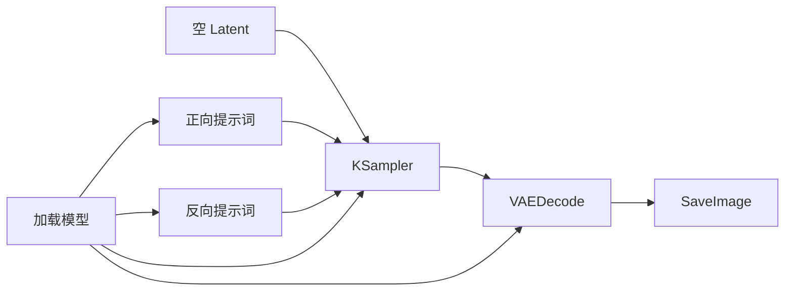
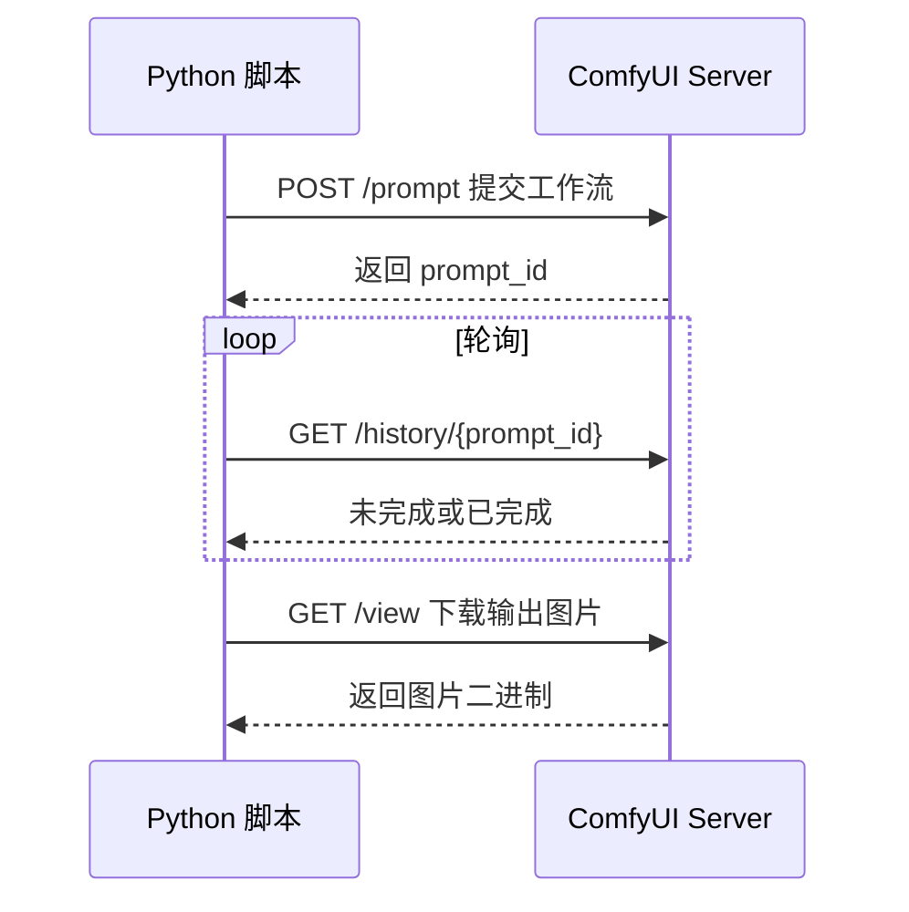

如果你准备开始用 `ComfyUI`，最容易卡住的不是“它强不强”，而是下面这几个非常实际的问题：

- 到底该装 `Desktop`、`Portable`，还是手动安装
- 第一次跑起来之后，模型放哪里
- 工作流在界面里能跑，不代表 API 一定会调
- 导出的 JSON 到底该怎么用

这篇文章不讲花哨工作流，先带你完成一条最小闭环：

1. 安装 `ComfyUI`
2. 跑通一个最基础的文生图工作流
3. 导出 `API Format`
4. 用 Python 调本地 `ComfyUI API`
5. 取回最终图片

<!--more-->

## 一、先说结论

如果你只是想尽快开始，我的建议是：

- **普通入门用户**：优先试 `ComfyUI Desktop`
- **Windows 想跟最新版本、方便折腾**：用 `Portable`
- **准备长期做 API、本地开发、脚本化管理**：优先 `comfy-cli` 或手动安装

原因很简单：

- `Desktop` 最省事
- `Portable` 最接近“下载即用”
- `comfy-cli / manual install` 最适合开发者做环境控制和自动化

---

## 二、先把官方安装路线讲清楚

根据 `2026-05-11` 可查的 `ComfyUI` 官方文档，当前本地安装路线主要分三类：

- `ComfyUI Desktop`
- `ComfyUI Portable (Windows)`
- `Manual Installation`

官方文档同时说明：

- `Desktop` 当前支持 `Windows` 和 `macOS (Apple Silicon)`，而且是基于稳定版构建
- `Portable` 是 Windows 专属，带独立嵌入式 Python，并且通常更接近最新提交
- `Manual Installation` 支持所有系统和多种硬件类型

另外，官方目前推荐：

- `Python 3.13` 支持很好，推荐
- `Python 3.12` 可以作为回退选项
- 浏览器最好使用 `Chrome 143` 或更高版本

这几个信息很重要，因为很多旧教程还在写 `Python 3.10 / 3.11`，而官方文档现在已经明确把 `3.13` 放到了推荐位。

---

## 三、我更推荐哪种安装方式

如果这篇文章的目标是“做第一个 API 工作流”，我更推荐你选下面两种之一。

## 3.1 Windows 用户：`Portable` 或 `comfy-cli`

如果你是 `Windows + Nvidia`，而且希望：

- 快速开始
- 比较容易跟最新版本
- 出问题时资料多

那：

- 纯入门先用 `Portable`
- 想长期做 API 和脚本化，直接用 `comfy-cli`

## 3.2 macOS / Linux / 多环境开发：`comfy-cli` 或手动安装

如果你是：

- `macOS`
- `Linux`
- 准备自己管 Python 环境
- 后面会写脚本、跑服务、做自动化

那我建议直接用 `comfy-cli` 或手动安装。

官方 `comfy-cli` 文档给出的最短路径是：

```bash
pip install comfy-cli
comfy install
comfy launch
```

这条路线很适合开发者。

---

## 四、本文采用的实战路径

为了兼顾“容易照着做”和“后面能接 API”，我下面用的是：

**`Python venv + comfy-cli + 本地 ComfyUI Server`**

这套方式的优点是：

- 环境边界清楚
- 后面写 Python 调 API 最顺
- 升级和排错都比较直接

---

## 五、安装 ComfyUI

## 5.1 创建虚拟环境

先进入你准备安装 `ComfyUI` 的目录。

### Windows PowerShell

```powershell
python -m venv comfy-env
.\comfy-env\Scripts\Activate.ps1
```

### macOS / Linux

```bash
python3 -m venv comfy-env
source comfy-env/bin/activate
```

如果你本机同时装了很多 Python 版本，建议先确认一下：

```bash
python --version
```

如果你准备严格跟官方推荐，优先使用 `Python 3.13`。  
如果某些自定义节点后面有兼容问题，再退回 `Python 3.12`。

## 5.2 安装 comfy-cli

```bash
pip install comfy-cli
```

## 5.3 安装 ComfyUI

```bash
comfy install
```

官方文档提醒得很明确：  
如果你要用 GPU，除了装 `ComfyUI` 本身，你还需要正确安装对应硬件的 `CUDA` 或 `ROCm` 相关依赖。

例如官方系统需求页当前给出的 `NVIDIA` 示例是：

```bash
pip install torch torchvision torchaudio --extra-index-url https://download.pytorch.org/whl/cu130
```

这不代表所有机器都必须照抄这条命令，但说明一点：  
**你的 PyTorch 和硬件驱动必须匹配。**

## 5.4 启动 ComfyUI

```bash
comfy launch
```

启动后，浏览器里打开本地地址。  
常见是：

```text
http://127.0.0.1:8188
```

如果你看到了 `ComfyUI` 的节点画布界面，说明服务已经起来了。

---

## 六、模型放哪里

很多人第一次打开界面后，最常见的问题是：

**界面能开，但没有模型可用。**

官方 `comfy-cli` 文档给出了模型下载命令格式：

```bash
comfy model download <url> models/checkpoints
```

你至少需要准备一个基础文生图模型放到：

```text
models/checkpoints
```

除此之外，常见还会涉及：

- `VAE`
- `LoRA`
- `ControlNet`
- `embeddings`

但第一篇入门文章里，你只要先有一个可用的 `checkpoint` 就够了。

如果你启动后在工作流里看不到模型，优先检查：

1. 模型文件是否真的放到了正确目录
2. 文件是否下载完整
3. `ComfyUI` 是否已经重启
4. 当前工作流节点的模型选择框里是否能看到该模型名

---

## 七、先跑通第一个界面工作流

在开始 API 之前，你一定要先做一件事：

**先在界面里跑通一次工作流。**

原因很简单：

- 如果界面里都跑不通，API 调用也不会通
- 这样可以先排掉模型路径、显存、节点缺失、依赖错误

## 7.1 最小工作流思路

最基础的文生图工作流一般会包含这些核心节点：

- `CheckpointLoaderSimple`
- `CLIPTextEncode` 正向提示词
- `CLIPTextEncode` 反向提示词
- `EmptyLatentImage`
- `KSampler`
- `VAEDecode`
- `SaveImage`

这就是最经典的最小文生图链路。

你可以把它理解成：



## 7.2 界面里先验证这几件事

第一次跑的时候，不要先追求画质，先确认：

1. 模型能被选到
2. 队列能提交
3. 工作流能执行完成
4. 输出目录里能看到图片

只要这四步通过，API 调用就有基础了。

---

## 八、为什么 API 调用前一定要先导出 API 格式

这是 `ComfyUI` 新手最容易忽略的一点。

在 `ComfyUI` 的前端里，你看到的是一个图形化工作流。  
但 API 并不是直接吃“画布状态截图”，而是吃一种结构化 JSON。

官方文档对这一点说得很清楚：

- API 接受的是 `API format`
- 这个格式以节点 `ID` 为键
- 每个节点包含 `class_type`、`inputs` 等字段
- 这个 JSON 由前端的 `Save (API Format)` 导出

所以正确姿势不是自己手搓第一版复杂 JSON，而是：

1. 在界面里把工作流调通
2. 从前端导出 `Save (API Format)`
3. 再在代码里改其中几个动态参数

这条路线最稳。

---

## 九、导出你的第一个 API 工作流

当你已经在界面里跑通一遍后，下一步就是导出工作流 JSON。

你需要在前端找到：

```text
Save (API Format)
```

然后把导出的 JSON 保存成一个文件，比如：

```text
workflow_api.json
```

这个文件通常长这样：

```json
{
  "3": {
    "class_type": "KSampler",
    "inputs": {
      "seed": 123456,
      "steps": 20
    }
  }
}
```

实际内容当然会更完整。  
你不用死记每个字段，只要先理解两件事：

1. **节点 ID 是字符串键**
2. **你后面要动态改的东西都在 `inputs` 里**

例如最常见的动态参数就是：

- 正向提示词
- 反向提示词
- `seed`
- 步数
- 分辨率

---

## 十、ComfyUI 本地 API 的核心接口

根据官方 `Routes` 文档，做第一个 API 工作流时，最常用的几个接口就是：

- `POST /prompt`：提交工作流到队列
- `GET /history/{prompt_id}`：拿到某次执行历史
- `GET /view`：读取输出图片
- `GET /queue`：查看队列状态
- `GET /prompt`：查看当前执行信息
- `WS /ws`：接收实时进度

如果你第一次只想跑通闭环，其实最小组合只要三个：

1. `POST /prompt`
2. `GET /history/{prompt_id}`
3. `GET /view`

---

## 十一、第一个 Python API 工作流实战

下面这段脚本走的是最稳的思路：

- 读取你导出的 `workflow_api.json`
- 替换提示词和种子
- 提交到本地 `ComfyUI`
- 轮询执行结果
- 下载生成后的图片

## 11.1 先安装 requests

```bash
pip install requests
```

## 11.2 新建脚本

新建一个文件：

```text
run_comfy_workflow.py
```

写入下面这段代码：

```python
import json
import time
import uuid
from pathlib import Path

import requests


SERVER = "http://127.0.0.1:8188"
WORKFLOW_FILE = Path("workflow_api.json")
OUTPUT_DIR = Path("comfy_outputs")


def load_workflow():
    with WORKFLOW_FILE.open("r", encoding="utf-8") as f:
        return json.load(f)


def patch_workflow(workflow, positive_text, negative_text, seed):
    # 这里的节点 ID 需要替换成你自己工作流里对应的节点 ID
    workflow["6"]["inputs"]["text"] = positive_text
    workflow["7"]["inputs"]["text"] = negative_text
    workflow["3"]["inputs"]["seed"] = seed
    return workflow


def queue_prompt(workflow, client_id):
    payload = {
        "prompt": workflow,
        "client_id": client_id,
    }
    response = requests.post(f"{SERVER}/prompt", json=payload, timeout=30)
    response.raise_for_status()
    return response.json()


def get_history(prompt_id):
    response = requests.get(f"{SERVER}/history/{prompt_id}", timeout=30)
    response.raise_for_status()
    return response.json()


def wait_for_finish(prompt_id, timeout_seconds=300):
    start = time.time()
    while True:
        history = get_history(prompt_id)
        if prompt_id in history:
            return history[prompt_id]

        if time.time() - start > timeout_seconds:
            raise TimeoutError("ComfyUI 执行超时")

        time.sleep(1)


def download_image(filename, subfolder, folder_type):
    params = {
        "filename": filename,
        "subfolder": subfolder,
        "type": folder_type,
    }
    response = requests.get(f"{SERVER}/view", params=params, timeout=60)
    response.raise_for_status()
    return response.content


def save_outputs(history_item):
    OUTPUT_DIR.mkdir(exist_ok=True)

    outputs = history_item.get("outputs", {})
    saved_files = []

    for node_id, node_output in outputs.items():
        images = node_output.get("images", [])
        for index, image_info in enumerate(images, start=1):
            image_bytes = download_image(
                image_info["filename"],
                image_info["subfolder"],
                image_info["type"],
            )
            save_path = OUTPUT_DIR / f"{node_id}_{index}_{image_info['filename']}"
            save_path.write_bytes(image_bytes)
            saved_files.append(save_path)

    return saved_files


def main():
    workflow = load_workflow()

    positive_text = "a cinematic portrait of a young woman, soft light, highly detailed"
    negative_text = "blurry, low quality, deformed"
    seed = 123456789

    workflow = patch_workflow(workflow, positive_text, negative_text, seed)

    client_id = str(uuid.uuid4())
    result = queue_prompt(workflow, client_id)

    prompt_id = result["prompt_id"]
    print("prompt_id =", prompt_id)

    history_item = wait_for_finish(prompt_id)
    files = save_outputs(history_item)

    print("生成完成，输出文件：")
    for file in files:
        print(file.resolve())


if __name__ == "__main__":
    main()
```

## 11.3 最关键的一步：改节点 ID

上面代码里这三行不是固定值：

```python
workflow["6"]["inputs"]["text"] = positive_text
workflow["7"]["inputs"]["text"] = negative_text
workflow["3"]["inputs"]["seed"] = seed
```

你必须根据自己导出的 `workflow_api.json` 来改。

也就是说，你要在 JSON 里找到：

- 哪个节点是正向提示词
- 哪个节点是反向提示词
- 哪个节点是 `KSampler`

如果你工作流结构不同，节点 ID 肯定也不同。

## 11.4 运行脚本

```bash
python run_comfy_workflow.py
```

如果一切正常，你会看到：

- 返回 `prompt_id`
- 脚本等待执行完成
- 在 `comfy_outputs` 目录下写出图片

---

## 十二、这段脚本背后到底做了什么

如果你理解了这段脚本，后面自己扩展就会很顺。

它的流程其实很简单：



也就是说，第一次 API 实战你只要掌握三件事：

1. 怎么提交
2. 怎么等结果
3. 怎么拿图片

---

## 十三、如果想实时看进度，再上 WebSocket

官方 `Routes` 文档说明，`/ws` 用于实时通信，能收到：

- `status`
- `execution_start`
- `executing`
- `progress`
- `executed`

如果你只是想先跑通，轮询已经够了。  
如果你后面要做：

- Web 页面实时进度条
- 后台任务追踪
- 批量队列监控

再把 `WebSocket` 接上会更合适。

官方仓库也提供了 `websockets_api_example.py` 示例，思路就是：

- 先连 `/ws`
- 再提交 `/prompt`
- 根据消息判断工作流何时完成
- 完成后再去 `/history` 和 `/view` 拿结果

这条路线更适合第二阶段。

---

## 十四、第一个 API 工作流最常见的报错

## 14.1 提交成功，但一直没结果

优先检查：

1. 模型是否真的存在
2. 工作流在界面里是否能跑通
3. 你的节点 ID 是否改错
4. 是否显存不足导致执行失败

## 14.2 `/prompt` 返回校验错误

官方 `Routes` 文档说明，`POST /prompt` 校验失败时会返回：

- `error`
- `node_errors`

这通常说明：

- JSON 结构不合法
- 某个节点缺参数
- 某个模型名无效
- 某个自定义节点不存在

最稳的排查方式就是：

- 先回到前端跑通
- 重新导出 `API Format`
- 再在代码里只改最少几个字段

## 14.3 脚本能跑，但没保存图片

通常要检查：

1. 输出节点是不是 `SaveImage`
2. `history` 里的 `outputs` 是否真包含 `images`
3. 下载 `view` 时的 `filename / subfolder / type` 是否完整传对

## 14.4 前端能跑，脚本不能跑

这种情况最常见的根因不是“API 坏了”，而是：

- 你代码里改错了节点 ID
- 工作流导出的不是 `API Format`
- 你修改了前端工作流，但导出的 JSON 没更新

这个坑非常常见。

---

## 十五、做第二个工作流时怎么升级

当你已经跑通第一条链路，下一步最值得升级的通常不是马上堆很多节点，而是把这几件事做对。

### 15.1 把动态参数收敛出来

例如只让业务层传：

- 正向提示词
- 反向提示词
- `seed`
- 宽高
- 步数

而不是每次都手改整份 JSON。

### 15.2 把工作流模板文件固定下来

建议把：

```text
workflow_api.json
```

当成模板文件管理，代码只做轻量 patch。

### 15.3 把轮询改成 WebSocket

如果你开始做前端页面、后台管理或批量任务，建议改成：

- `POST /prompt`
- `WS /ws`
- `GET /history/{prompt_id}`

这样体验会更好。

### 15.4 再考虑自定义节点

不要一开始就装太多自定义节点。  
先把基础链路稳定下来，再往上叠：

- `LoRA`
- `ControlNet`
- 图像输入
- 人像修复
- 视频节点

这样排错成本低很多。

---

## 十六、我对新手的实际建议

如果你现在刚入门，我建议按下面顺序做，不要跳步：

1. 先把 `ComfyUI` 跑起来
2. 先在前端成功生成一张图
3. 导出 `Save (API Format)`
4. 用 Python 只改提示词和种子
5. 先用轮询跑通，再考虑 WebSocket

这样你很快就能从“会点界面”升级到“会把工作流接进程序”。

对大多数人来说，这一步才是 `ComfyUI` 真正开始变有价值的时候。

---

## 参考资料

- ComfyUI 官方文档首页：<https://docs.comfy.org/index>
- ComfyUI 系统需求：<https://docs.comfy.org/installation/system_requirements>
- comfy-cli Getting Started：<https://docs.comfy.org/comfy-cli/getting-started>
- ComfyUI Server Routes：<https://docs.comfy.org/development/comfyui-server/comms_routes>
- ComfyUI Server Overview：<https://docs.comfy.org/development/comfyui-server/comms_overview>
- ComfyUI Server Messages：<https://docs.comfy.org/development/comfyui-server/comms_messages>
- ComfyUI Cloud API Overview（用于说明 API format 导出方式）：<https://docs.comfy.org/development/cloud/overview>
- ComfyUI 官方仓库脚本示例：<https://github.com/Comfy-Org/ComfyUI/blob/master/script_examples/websockets_api_example.py>
