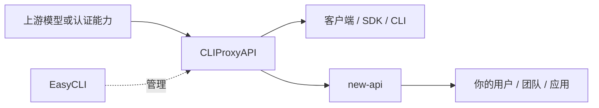
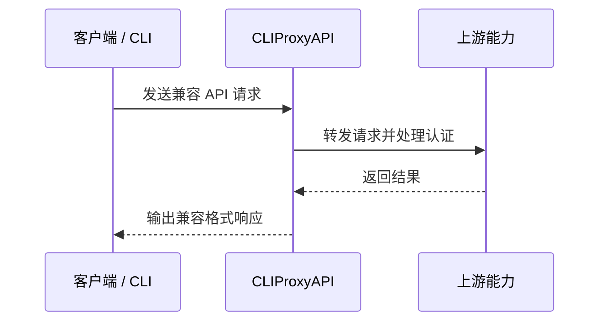
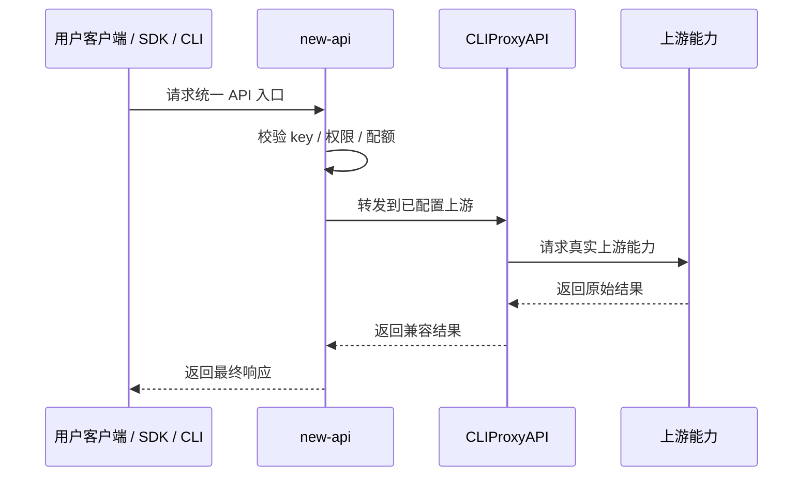
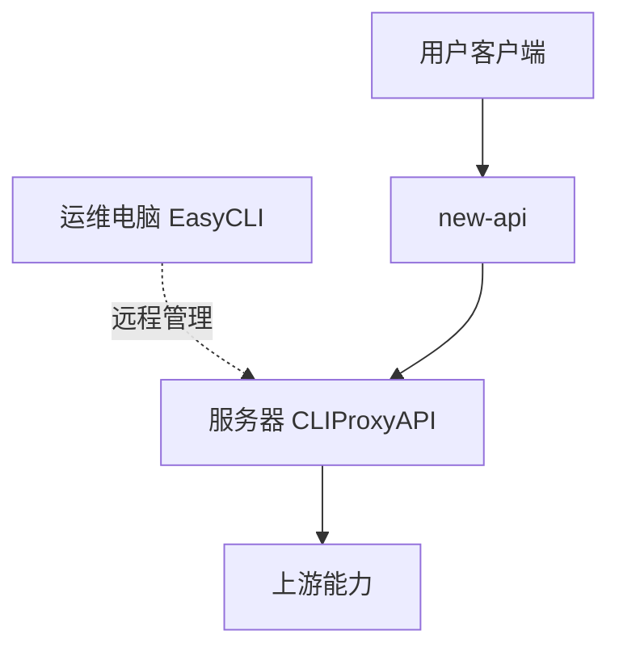

很多人在接触 `router-for-me/EasyCLI`、`router-for-me/CLIProxyAPI` 和 `QuantumNous/new-api` 这三个项目时，最容易混淆的一点，不是怎么部署，而是它们分别处在整条链路的哪一层。

<!--more-->

这篇文章不去堆砌功能表，而是先把三者的职责拆开，再给出一套更容易理解的使用路径。

## 一、先说结论

如果只用一句话概括：

- `CLIProxyAPI` 是真正提供兼容 API 的代理服务
- `EasyCLI` 是 `CLIProxyAPI` 的桌面图形化管理工具
- `new-api` 是更上层的统一网关、权限、配额和分发平台

所以它们通常不是互相替代关系，而是上下游关系。

你可以先用下面这张图理解：



如果把这三个项目类比成一套基础设施：

- `CLIProxyAPI` 像发动机
- `EasyCLI` 像控制台
- `new-api` 像统一入口和调度中心

---

## 二、这三个项目分别是干什么的

### 2.1 CLIProxyAPI：能力接入层

根据官方 README，`CLIProxyAPI` 的定位是提供 `OpenAI / Gemini / Claude / Codex compatible API interfaces for CLI`。它的核心作用，是把不同来源的 CLI 或认证能力，包装成统一的兼容 API。

项目地址：

- <https://github.com/router-for-me/CLIProxyAPI>

如果你只关心“让某个客户端、脚本、终端工具能用统一接口访问上游能力”，那 `CLIProxyAPI` 才是核心。

从职责上说，它主要处理的是：

- 兼容接口暴露
- 请求转发
- 上游接入
- 认证文件和账号能力接入
- 多账号轮询或基础路由

这意味着，`CLIProxyAPI` 更像一个“协议转换层”和“代理层”。

### 2.2 EasyCLI：图形化管理层

`EasyCLI` 的官方 README 写得很直接，它是 `Tauri GUI for CLIProxyAPI`。也就是说，它并不是代理服务本体，而是一个桌面 GUI，用来帮助你管理 `CLIProxyAPI`。

项目地址：

- <https://github.com/router-for-me/EasyCLI>

它更适合做这些事：

- 下载和更新 `CLIProxyAPI`
- 启动和停止本地服务
- 图形化修改配置
- 管理认证文件
- 管理第三方 API key
- 连接本地或远程的 `CLIProxyAPI`

所以 `EasyCLI` 本质上是“管理工具”，不是“服务引擎”。

### 2.3 new-api：平台分发层

`new-api` 的官方定位是 `Next-Generation LLM Gateway and AI Asset Management System`。它的重点不是把 CLI 能力转成 API，而是把各种模型和渠道能力做成一个更完整的平台。

项目地址：

- <https://github.com/QuantumNous/new-api>

它更偏向这些平台能力：

- 多模型统一入口
- 渠道路由
- API key 管理
- 用户权限和模型可见范围控制
- 配额和限流
- 后台管理
- 统计与计费

所以如果你要做的不只是“自己能调用”，而是“多人调用、可管理、可统计、可分发”，`new-api` 的位置就很重要。

---

## 三、三者之间的关系到底是什么

最容易理解的方法，是按层来拆。

### 3.1 第一层：能力接入

这一层是 `CLIProxyAPI`。

它负责把上游能力接进来，统一暴露成兼容 API。没有这一层，后面的客户端、CLI 或平台就没有一个稳定统一的接口可以调用。

### 3.2 第二层：运维和管理

这一层是 `EasyCLI`。

它不取代 `CLIProxyAPI`，只是让你不必总靠命令行和手改配置文件去维护它。对于个人电脑、本地测试、桌面使用场景，它的价值非常直接。

### 3.3 第三层：平台治理和分发

这一层是 `new-api`。

它不是围绕“本地 GUI 管理”设计的，而是围绕“统一出口、用户管理、配额和渠道治理”设计的。

因此，最常见的链路是：

```text
上游能力 -> CLIProxyAPI -> new-api -> 用户 / 应用 / 团队
```

而 `EasyCLI` 常见的作用是：

```text
EasyCLI -> 管理本地或远程 CLIProxyAPI
```

---

## 四、什么时候用哪个

### 4.1 只想先跑通接口

如果你的目标只是：

- 自己测试
- 让本地脚本调用
- 让某个终端或客户端先连上
- 先确认兼容 API 能工作

那通常只要先上 `CLIProxyAPI`。

### 4.2 不想一直手改配置

如果你已经确认 `CLIProxyAPI` 能工作，但觉得：

- 配置项太多
- 认证文件不好管理
- 每次下载更新太麻烦
- 更习惯在 Windows 或 macOS 上点点点操作

那就加 `EasyCLI`。

### 4.3 要做成统一平台

如果你的目标变成：

- 给多人发 key
- 给不同用户分配额度
- 控制可用模型
- 做渠道权重和容错
- 做后台面板和统计
- 做平台级 API 出口

那就应该把 `new-api` 放到最外层。

---

## 五、一个最实用的理解方式

很多人卡住，是因为把 `EasyCLI` 当成服务，把 `CLIProxyAPI` 当成后台面板，结果职责全反了。

更准确的理解应该是：

| 项目 | 主要角色 | 是否核心服务 | 更适合谁 |
|------|----------|--------------|----------|
| `CLIProxyAPI` | 代理服务 / 兼容接口层 | 是 | 需要 API 的开发者 |
| `EasyCLI` | GUI 管理工具 | 否 | 喜欢图形化配置的用户 |
| `new-api` | 网关 / 分发 / 管理平台 | 是 | 做团队或平台出口的人 |

所以不要问“`EasyCLI` 和 `CLIProxyAPI` 二选一还是 `CLIProxyAPI` 和 `new-api` 二选一”，更合理的问题是：

- 我现在需要的是服务层、管理层，还是平台层
- 我是个人本地使用，还是团队统一分发

---

## 六、典型使用方案

### 6.1 方案一：个人本地测试

这是最简单的一种。

```text
本地客户端 / 终端 -> CLIProxyAPI
```

你也可以加上：

```text
EasyCLI -> 管理本地 CLIProxyAPI
```

适合场景：

- 个人学习
- 本地调试
- 验证兼容接口
- 先看链路能不能跑通

### 6.2 方案二：小团队内部共用

```text
团队内部应用 -> CLIProxyAPI
                 ^
                 |
              EasyCLI
```

这时可以把 `CLIProxyAPI` 放在一台服务器或固定机器上，再用 `EasyCLI` 做配置管理。这样比每个人各自维护一套轻很多。

适合场景：

- 内部自用
- 成员数量不多
- 不急着做平台化配额

### 6.3 方案三：平台化统一出口

```text
用户 / 第三方应用 -> new-api -> CLIProxyAPI -> 上游能力
                                  ^
                                  |
                               EasyCLI
```

这是三者配合最清晰的一种方式：

- `CLIProxyAPI` 负责接上游能力
- `EasyCLI` 负责维护 `CLIProxyAPI`
- `new-api` 负责统一对外分发

适合场景：

- 团队协作
- 模型渠道较多
- 需要用户、额度、统计、权限

---

## 七、建议的使用顺序

不要一开始就三套一起上。更稳的方式是分阶段推进。

### 7.1 第一步：先把 CLIProxyAPI 跑通

优先验证这几件事：

- 服务能启动
- 配置能生效
- 客户端能发请求
- 流式响应或基础调用正常

这一阶段的目标不是“架构优雅”，而是“确认链路真的通”。

### 7.2 第二步：再加 EasyCLI

当你确认服务可以正常工作后，再决定是否需要图形化管理。

如果你本身就很习惯命令行，也愿意直接维护配置文件，那 `EasyCLI` 并不是必选项。

### 7.3 第三步：最后接入 new-api

等前面的代理层已经稳定之后，再把 `new-api` 放到外层，去做：

- key 管理
- 用户管理
- 配额限制
- 模型路由
- 分发策略

这时候职责才是清楚的，不容易把问题混在一起排查。

---

## 八、实际使用时的注意点

### 8.1 不要把 GUI 当成服务本体

`EasyCLI` 再方便，它依然只是管理工具。真正提供兼容接口的是 `CLIProxyAPI`。

### 8.2 不要把代理层和平台层混为一谈

`CLIProxyAPI` 解决的是“怎么接、怎么转、怎么兼容”。  
`new-api` 解决的是“怎么管、怎么分、怎么控”。

这两类问题虽然都在 API 链路里，但不是一个层次。

### 8.3 做对外服务时要先看上游授权和条款

如果你打算把某种上游能力继续包装后给团队或用户使用，必须先确认：

- 上游是否允许这种使用方式
- 账号类型是否支持
- 认证方式是否合规
- 你是否有权再分发

这件事不是部署问题，而是合规问题。  
技术上能接通，不代表运营上就应该这样做。

---

## 九、一个更稳的落地思路

如果你是从零开始搭，比较稳的路径通常是：

1. 本机部署 `CLIProxyAPI`
2. 用一个兼容客户端或终端先做最小调用测试
3. 如果你不想手改配置，再安装 `EasyCLI`
4. 等代理层稳定后，再前置 `new-api`
5. 最后再考虑用户体系、配额、限流和监控

这条路径的优点是：

- 排错简单
- 层次清楚
- 不会一开始就把问题堆在一起

---

## 十、实战部署顺序

如果你准备实际动手，最推荐的顺序不是三套一起装，而是按依赖关系逐步往上叠。

### 10.1 第一阶段：先部署 CLIProxyAPI

第一阶段的目标只有一个：确认代理层真的可用。

你要完成的事情通常包括：

1. 安装并启动 `CLIProxyAPI`
2. 配置好它需要的上游能力或认证信息
3. 找一个兼容客户端做最小请求测试
4. 确认返回格式、认证方式和流式输出都正常

这一阶段建议不要急着接 `new-api`。  
因为如果代理层本身都还没稳定，后面再套一层网关，只会让排错更复杂。

### 10.2 第二阶段：按需加 EasyCLI

如果你已经能用命令行把 `CLIProxyAPI` 跑起来，但觉得运维体验不够好，再加 `EasyCLI`。

这一阶段适合做的事情是：

1. 用 `EasyCLI` 接管本地或远程 `CLIProxyAPI`
2. 通过 GUI 检查配置项是否正确
3. 管理认证文件或第三方 key
4. 做版本更新和日常维护

这里要注意一个顺序问题：

- 先有 `CLIProxyAPI`
- 再有 `EasyCLI`

不要反过来理解。

### 10.3 第三阶段：最后前置 new-api

当你确认代理层稳定、配置也已经固定下来以后，再把 `new-api` 放到最外层。

这一阶段重点做的是：

1. 在 `new-api` 中添加上游渠道
2. 把 `CLIProxyAPI` 暴露出来的接口作为一个上游入口
3. 在 `new-api` 中配置模型映射、路由和用户权限
4. 给客户端统一发放 `new-api` 的访问 key
5. 在 `new-api` 中做额度、限流、统计和管理

这样做之后，外部用户一般就不需要直接接触 `CLIProxyAPI` 了。

### 10.4 推荐的本地测试顺序

如果你是在一台电脑上先做全链路验证，可以按这个顺序：

```text
1. 启动 CLIProxyAPI
2. 用客户端直连 CLIProxyAPI 测试
3. 安装并连接 EasyCLI
4. 确认 EasyCLI 能正常管理 CLIProxyAPI
5. 部署 new-api
6. 在 new-api 中把 CLIProxyAPI 配成上游
7. 让客户端改为连接 new-api
8. 对比 new-api 直连前后的返回结果
```

这个顺序的价值在于，每一步的责任边界都很清楚。

---

## 十一、调用链路怎么理解

很多人知道这三个项目能配合，但不知道请求到底是怎么走的。  
如果把一次普通请求拆开，整个过程其实不复杂。

### 11.1 只有 CLIProxyAPI 时

在最小链路里，请求是这样走的：



这个阶段最适合做功能验证，因为链路最短，出问题最好定位。

### 11.2 加上 EasyCLI 之后

加上 `EasyCLI` 后，请求链路本身通常不变。  
`EasyCLI` 不是请求转发节点，它更像一个控制面板。

也就是说：

```text
客户端请求仍然是 Client -> CLIProxyAPI -> 上游
EasyCLI 负责的是配置、启动、更新和管理
```

这是理解 `EasyCLI` 角色最关键的一点。

### 11.3 再加上 new-api 之后

当前置 `new-api` 之后，请求链路就会变成：



这个结构最适合平台化使用，因为：

- `new-api` 统一对外
- `CLIProxyAPI` 专门处理能力接入
- 上游变化不会直接暴露给用户

### 11.4 出问题时怎么定位

这种分层结构还有一个很实际的好处，就是排错路径更清晰。

如果用户请求失败，你可以按顺序查：

1. 客户端到 `new-api` 是否正常
2. `new-api` 的 key、权限、模型映射是否正常
3. `new-api` 到 `CLIProxyAPI` 的上游配置是否正常
4. `CLIProxyAPI` 到真实上游是否正常
5. 上游本身是否可用

这样不会一上来就把所有问题都归咎于“模型不稳定”。

---

## 十二、从单机到平台化的一条落地路线

如果你打算从个人测试慢慢走到团队使用，比较稳的路线通常是：

### 12.1 第一步：单机验证

- 本机部署 `CLIProxyAPI`
- 先只测试最小接口调用
- 确认配置文件和认证文件没有问题

### 12.2 第二步：本机图形化管理

- 安装 `EasyCLI`
- 让本地维护动作图形化
- 把配置、更新和日常操作收敛到 GUI

### 12.3 第三步：内网共享

- 把 `CLIProxyAPI` 放到一台固定机器或服务器
- 让内部应用统一通过它调用
- 保持调用面尽量简单

### 12.4 第四步：统一网关出口

- 部署 `new-api`
- 把 `CLIProxyAPI` 作为后端能力层
- 用户只对接 `new-api`

### 12.5 第五步：治理和运营

- 在 `new-api` 中做 key 管理
- 配额、限流和访问控制
- 统计调用量和失败率
- 逐步调整模型映射和分发策略

这条路线的优点，是技术债不会一下子堆起来。

---

## 十三、Windows 本机部署思路

如果你是个人开发者，或者只是想先在 Windows 上把整体链路跑起来，最稳的方式通常是先把角色拆开，再分别验证。

### 13.1 推荐的本机部署结构

在 Windows 本机环境里，更容易维护的一种结构通常是：

```text
Windows 桌面
├─ EasyCLI
├─ CLIProxyAPI
├─ new-api
└─ 你的测试客户端 / 终端工具
```

实际调用时的关系是：

```text
测试客户端 -> new-api -> CLIProxyAPI -> 上游能力
EasyCLI 负责管理 CLIProxyAPI
```

如果你只是先验证代理层，那就临时跳过 `new-api`，直接让客户端连 `CLIProxyAPI`。

### 13.2 本机部署的推荐步骤

建议按下面这条顺序执行：

1. 先单独部署 `CLIProxyAPI`
2. 用最小请求验证它能正常返回
3. 再安装 `EasyCLI`
4. 用 `EasyCLI` 接管 `CLIProxyAPI` 的配置和运行
5. 最后部署 `new-api`
6. 在 `new-api` 中把 `CLIProxyAPI` 加为上游
7. 让客户端切到 `new-api` 入口测试

这样做的原因很简单：

- 出问题时更容易知道是哪一层出了问题
- 你不会把 GUI、代理和网关三层问题混在一起

### 13.3 Windows 本机测试时建议优先验证什么

在 Windows 本机环境里，我更建议先验证下面四件事：

1. `CLIProxyAPI` 是否真的在监听端口
2. 本地客户端能否直接调通 `CLIProxyAPI`
3. `EasyCLI` 是否能正确读写和管理 `CLIProxyAPI`
4. `new-api` 接入之后是否只是“多了一层网关”，而不是改坏了原链路

如果你跳过这四步，直接把三者全都装好再一起测，后面排错通常会变得很痛苦。

### 13.4 Windows 本机适合做什么，不适合做什么

更适合：

- 本地学习
- 功能验证
- 接口联调
- 个人开发环境

不太适合：

- 长期对外服务
- 高并发场景
- 多人共同依赖的生产入口

因为一旦是生产用途，Windows 本机的稳定性、运维方式和自动恢复能力，通常都不如单独的服务器部署清晰。

---

## 十四、服务器部署拓扑示例

当你从“本地测试”走向“稳定提供服务”时，更推荐把代理层和网关层拆到服务器上。

### 14.1 最简单的服务器拓扑

最小可用的服务器结构通常是：

```text
用户 / 客户端
    |
    v
new-api
    |
    v
CLIProxyAPI
    |
    v
上游能力
```

这是一种非常清楚的分层：

- `new-api` 负责对外
- `CLIProxyAPI` 负责对内接上游

### 14.2 带管理端的拓扑

如果你还想保留图形化管理体验，可以把 `EasyCLI` 放在你的运维电脑上，远程管理服务器里的 `CLIProxyAPI`。



这种方式的好处是：

- 用户不接触代理层
- 代理层不直接暴露给所有人
- 你自己仍然能保留图形化管理习惯

### 14.3 更适合长期维护的思路

如果是准备长期跑服务，建议遵循这几个原则：

1. `new-api` 做统一入口
2. `CLIProxyAPI` 只暴露给内网或受控环境
3. `EasyCLI` 只作为管理工具使用
4. 不让普通用户直接接触代理层配置

这样能避免后期接口层次混乱。

### 14.4 服务器部署时最该关注什么

相比本机测试，服务器部署更该关注这些内容：

- 端口暴露范围
- 反向代理和 HTTPS
- 用户访问控制
- 上游异常时的重试和降级
- 日志和监控
- 配置文件备份

换句话说，服务器环境的重点已经不是“能不能跑起来”，而是“是不是能长期稳定跑”。

### 14.5 从测试到生产的一个平滑迁移方式

如果你已经在本机跑通了整条链路，可以这样迁移：

1. 把 `CLIProxyAPI` 迁到服务器
2. 先让 `new-api` 仍然在本机连服务器版 `CLIProxyAPI`
3. 确认接口返回一致
4. 再把 `new-api` 也迁到服务器
5. 最后让客户端统一切到服务器入口

这种迁移方式比“一次性全搬过去”稳很多。

---

## 十五、常见误区

### 15.1 误区一：EasyCLI 能替代 CLIProxyAPI

不能。  
`EasyCLI` 的定位是图形化管理工具，不是代理服务本体。

### 15.2 误区二：new-api 可以直接替代 CLIProxyAPI 的接入能力

不能简单这样理解。  
`new-api` 更偏平台网关和治理层，`CLIProxyAPI` 更偏能力接入和兼容层。

### 15.3 误区三：本机跑通就等于生产可用

不等于。  
本机跑通只能说明链路基本正确，不代表生产环境下的稳定性、权限边界和恢复能力都已经满足要求。

### 15.4 误区四：三个项目一定要一起用

也不是。  
很多情况下：

- 只用 `CLIProxyAPI` 就够了
- 或者 `CLIProxyAPI + EasyCLI` 就够了
- 只有在你真的需要统一分发和治理时，才有必要再上 `new-api`

---

## 十六、接口测试示例

真正开始联调时，最有价值的不是“装了什么”，而是“请求到底能不能走通”。  
所以更实用的做法，是准备两套测试：

- 一套直连 `CLIProxyAPI`
- 一套通过 `new-api`

然后对比两边的返回是否一致。

### 16.1 测试前先准备什么

在开始之前，先把下面几个变量替换成你自己的实际值：

```text
CLI_PROXY_BASE=http://127.0.0.1:你的端口
NEW_API_BASE=http://127.0.0.1:你的端口
MODEL_NAME=你的模型名
API_KEY=你的访问密钥
```

这里不要直接照抄端口和模型名。  
更稳的方式是先去你自己的配置里确认，再替换到命令里。

### 16.2 用 curl 直连 CLIProxyAPI

如果你先验证代理层本身，可以先用一条最小化请求测试 `CLIProxyAPI`。

```bash
curl http://127.0.0.1:你的端口/v1/chat/completions \
  -H "Content-Type: application/json" \
  -H "Authorization: Bearer 你的密钥" \
  -d '{
    "model": "你的模型名",
    "messages": [
      {
        "role": "user",
        "content": "请回复：CLIProxyAPI 直连测试成功"
      }
    ],
    "stream": false
  }'
```

你在这里主要看三件事：

- 接口能不能连上
- 是否返回标准兼容格式
- 是否出现认证错误或模型名错误

如果这一步都还没通，不要急着去测 `new-api`。

### 16.3 用 curl 通过 new-api 调用

当你已经把 `CLIProxyAPI` 配成 `new-api` 的上游以后，再测这条：

```bash
curl http://127.0.0.1:你的端口/v1/chat/completions \
  -H "Content-Type: application/json" \
  -H "Authorization: Bearer 你的 new-api key" \
  -d '{
    "model": "你在 new-api 中映射后的模型名",
    "messages": [
      {
        "role": "user",
        "content": "请回复：new-api 转发测试成功"
      }
    ],
    "stream": false
  }'
```

如果这条不通，而直连 `CLIProxyAPI` 是通的，优先排查：

- `new-api` 的 key 是否正确
- `new-api` 里的模型映射是否正确
- `new-api` 指向 `CLIProxyAPI` 的上游地址是否正确

### 16.4 用 PowerShell 直连 CLIProxyAPI

如果你在 Windows 下测试，PowerShell 往往更顺手。

```powershell
$body = @{
    model = "你的模型名"
    messages = @(
        @{
            role = "user"
            content = "请回复：CLIProxyAPI PowerShell 测试成功"
        }
    )
    stream = $false
} | ConvertTo-Json -Depth 10

Invoke-RestMethod -Uri "http://127.0.0.1:你的端口/v1/chat/completions" `
    -Method POST `
    -Headers @{
        "Authorization" = "Bearer 你的密钥"
    } `
    -Body $body `
    -ContentType "application/json"
```

如果接口正常，PowerShell 会直接把 JSON 解析成对象，更方便你检查返回内容。

### 16.5 用 PowerShell 通过 new-api 调用

```powershell
$body = @{
    model = "你在 new-api 中映射后的模型名"
    messages = @(
        @{
            role = "user"
            content = "请回复：new-api PowerShell 测试成功"
        }
    )
    stream = $false
} | ConvertTo-Json -Depth 10

Invoke-RestMethod -Uri "http://127.0.0.1:你的端口/v1/chat/completions" `
    -Method POST `
    -Headers @{
        "Authorization" = "Bearer 你的 new-api key"
    } `
    -Body $body `
    -ContentType "application/json"
```

如果这一条失败，而直连 `CLIProxyAPI` 成功，说明问题大概率不在上游本身，而是在 `new-api` 这一层。

### 16.6 流式响应怎么测

如果你还想验证流式输出，就把请求中的：

```json
"stream": false
```

改成：

```json
"stream": true
```

然后重点检查：

- 是否持续返回分片
- 是否被中间层截断
- `new-api` 转发后是否仍保持流式行为

这一步对终端工具和 CLI 尤其重要。

### 16.7 最小排错顺序

做接口联调时，最推荐的排错顺序是：

1. 先测 `CLIProxyAPI`
2. 再测 `new-api`
3. 对比两边的模型名、key 和返回格式
4. 最后再接入真正的客户端或 CLI 工具

这比一上来就让复杂客户端直连整条链路要稳很多。

---

## 十七、总结

把这三个项目的角色记住，后面基本就不会再混淆：

- `CLIProxyAPI` 负责把能力变成兼容 API
- `EasyCLI` 负责把 `CLIProxyAPI` 管起来更轻松
- `new-api` 负责把这些能力做成统一出口和平台服务

如果你现在只是想先用起来，先看 `CLIProxyAPI`。  
如果你想图形化管理，再加 `EasyCLI`。  
如果你想对外做统一入口和平台治理，再把 `new-api` 接到最外层。

---

## 参考资料

- EasyCLI: <https://github.com/router-for-me/EasyCLI>
- CLIProxyAPI: <https://github.com/router-for-me/CLIProxyAPI>
- new-api: <https://github.com/QuantumNous/new-api>
